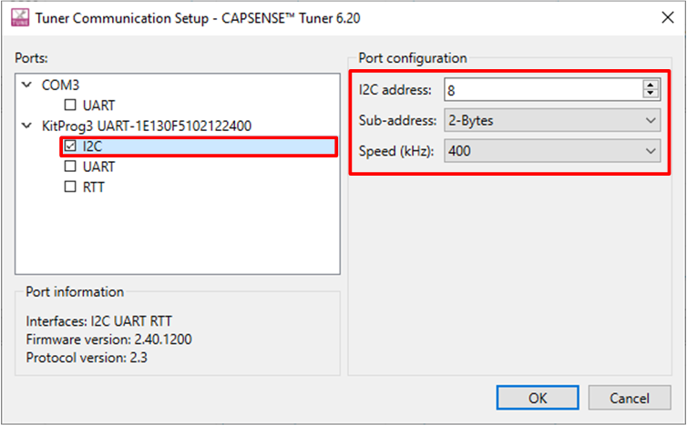
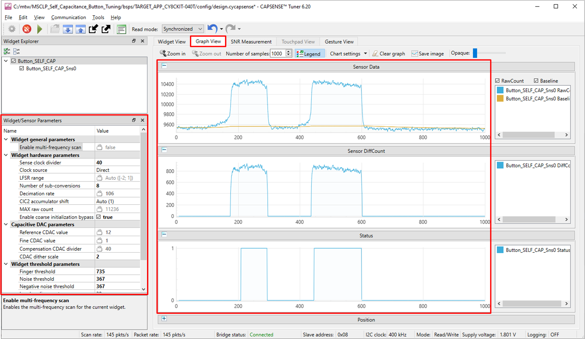
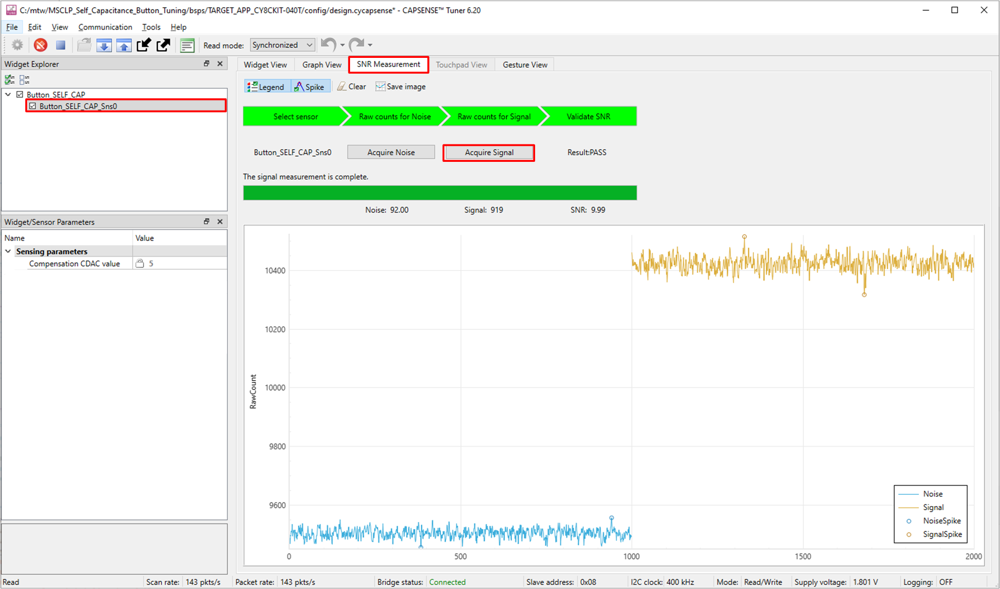
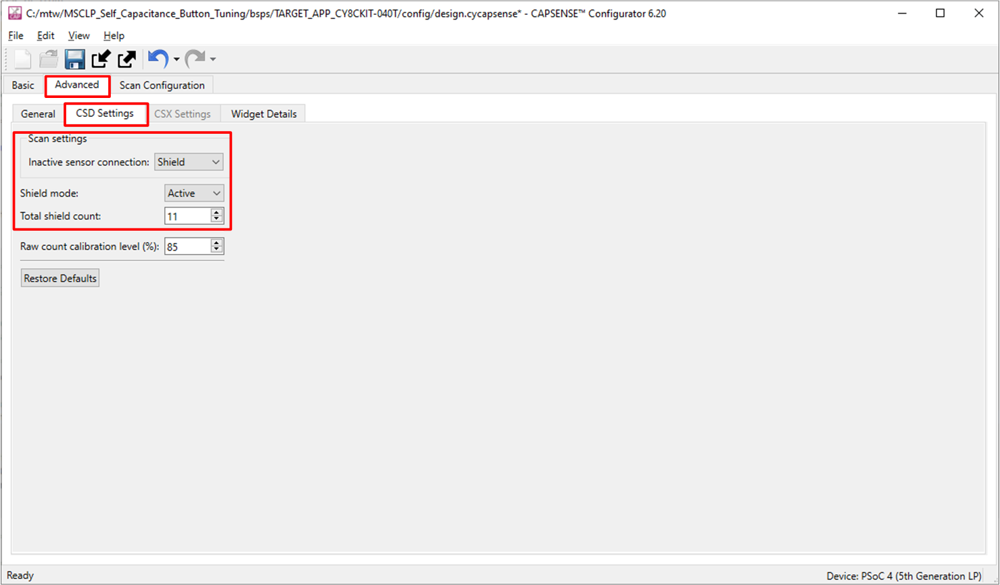
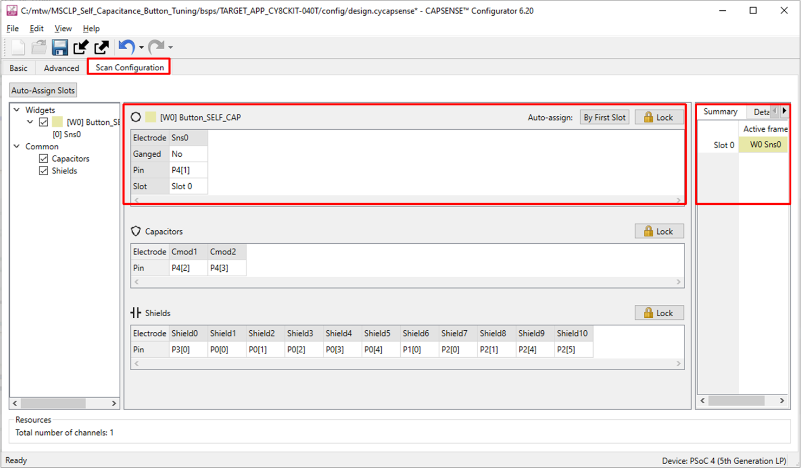
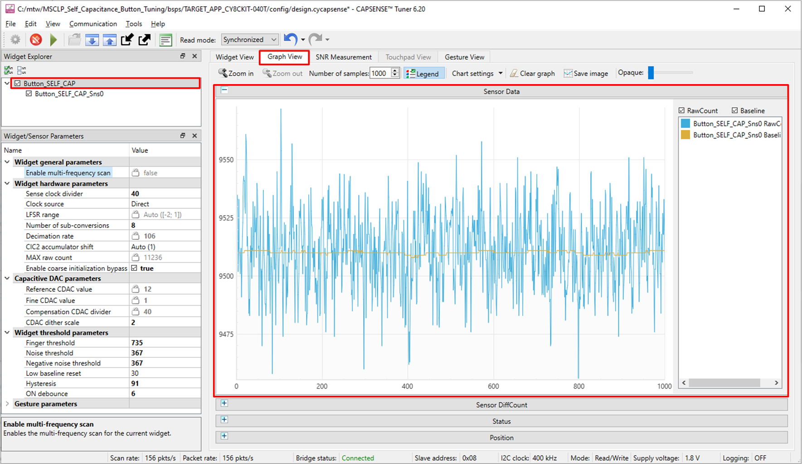
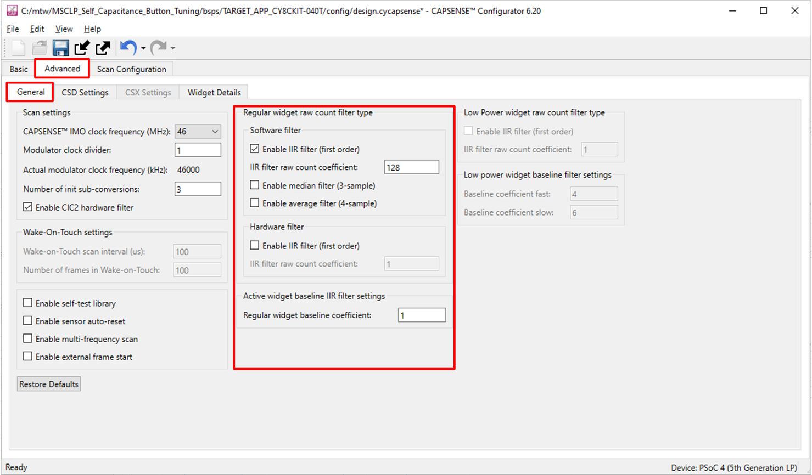
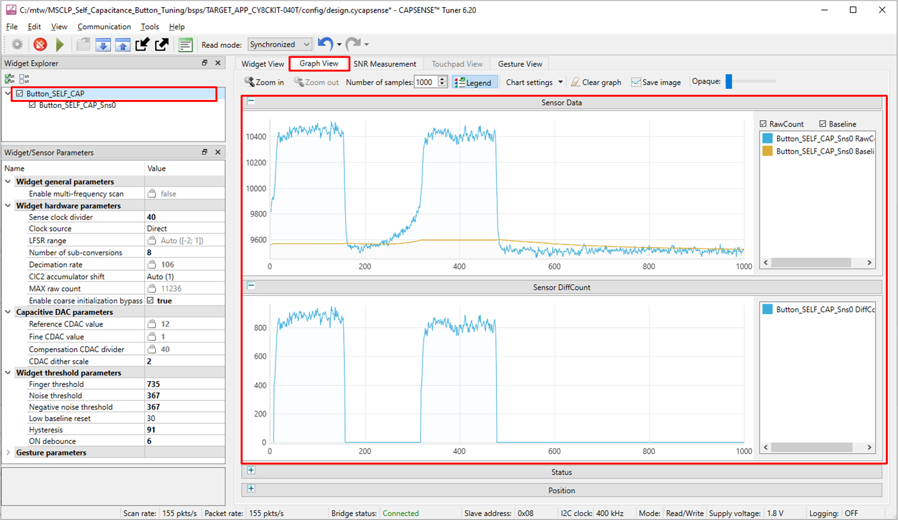
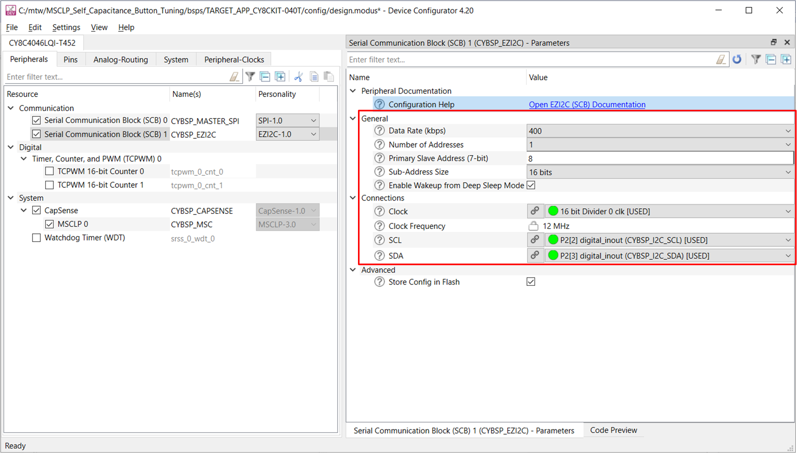

# PSoC&trade; 4: MSCLP self-capacitance button tuning

This code example demonstrates how to use the CAPSENSE&trade; middleware to detect a finger touch on a self-capacitance-based button widget in PSoC&trade; 4000T device with multi sense converter low power (MSCLP).

In addition, this code example also explains how to manually tune the self-capacitance-based button for optimum performance w.r.t parameters such as reliability, power consumption, and response time using the CSD-RM sensing technique and CAPSENSE&trade; tuner GUI. Here, CAPSENSE&trade; Sigma Delta (CSD) represents the self-capacitance sensing technique and RM represents the ratiometric method.

[View this README on GitHub.](https://github.com/Infineon/mtb-example-psoc4-msclp-self-capacitance-button)

[Provide feedback on this code example.](https://cypress.co1.qualtrics.com/jfe/form/SV_1NTns53sK2yiljn?Q_EED=eyJVbmlxdWUgRG9jIElkIjoiQ0UyMzUxNzgiLCJTcGVjIE51bWJlciI6IjAwMi0zNTE3OCIsIkRvYyBUaXRsZSI6IlBTb0MmdHJhZGU7IDQ6IE1TQ0xQIHNlbGYtY2FwYWNpdGFuY2UgYnV0dG9uIHR1bmluZyIsInJpZCI6InNoYXJ3YXJpIiwiRG9jIHZlcnNpb24iOiIxLjAuMSIsIkRvYyBMYW5ndWFnZSI6IkVuZ2xpc2giLCJEb2MgRGl2aXNpb24iOiJNQ0QiLCJEb2MgQlUiOiJJQ1ciLCJEb2MgRmFtaWx5IjoiUFNPQyJ9)


## Requirements

- [ModusToolbox&trade; software](https://www.cypress.com/products/modustoolbox-software-environment) v3.0 or later

   **Note:** This code example version requires ModusToolbox&trade; software version 3.0 or later, and is not backward compatible with v2.4 or older versions.

- Board support package (BSP) minimum required version: 0.5.0
- Programming language: C
- Associated parts: [PSoC&trade; 4000T](https://www.infineon.com/002-33949)

## Supported toolchains (make variable 'TOOLCHAIN')

- GNU Arm&reg; embedded compiler v10.3.1 (`GCC_ARM`) - Default value of `TOOLCHAIN`
- Arm&reg; compiler v6.13 (`ARM`)
- IAR C/C++ compiler v8.42.2 (`IAR`)

## Supported kits (make variable 'TARGET')

- [PSoC&trade; 4000T CAPSENSE&trade; evaluation kit](https://www.infineon.com/CY8CKIT-040T) (`CY8CKIT-040T`) - Default value of `TARGET`

## Hardware setup

This example uses the board's default configuration. See the [Kit user guide](www.infineon.com/002-34472) to ensure that the board is configured correctly.

## Software setup

This example requires no additional software or tools.

## Using the code example

Create the project and open it using one of the following:

<details><summary><b>In Eclipse IDE for ModusToolbox&trade; software</b></summary>

1. Click the **New Application** link in the **Quick Panel** (or, use **File** > **New** > **ModusToolbox Application**). This launches the [Project Creator](https://www.cypress.com/ModusToolboxProjectCreator) tool.

2. Pick a kit supported by the code example from the list shown in the **Project Creator - Choose Board Support Package (BSP)** dialog.

   When you select a supported kit, the example is reconfigured automatically to work with the kit. To work with a different supported kit later, use the [Library Manager](https://www.cypress.com/ModusToolboxLibraryManager) to choose the BSP for the supported kit. You can use the Library Manager to select or update the BSP and firmware libraries used in this application. To access the Library Manager, click the link from the **Quick Panel**.

   You can also just start the application creation process again and select a different kit.

   If you want to use the application for a kit not listed here, you may need to update the source files. If the kit does not have the required resources, the application may not work.

3. In the **Project Creator - Select Application** dialog, choose the example by enabling the checkbox.

4. (Optional) Change the suggested **New Application Name**.

5. The **Application(s) Root Path** defaults to the Eclipse workspace which is usually the desired location for the application. If you want to store the application in a different location, you can change the *Application(s) Root Path* value. Applications that share libraries should be in the same root path.

6. Click **Create** to complete the application creation process.

For more details, see the [Eclipse IDE for ModusToolbox&trade; software user guide](https://www.cypress.com/MTBEclipseIDEUserGuide) (locally available at *{ModusToolbox&trade; software install directory}/ide_{version}/docs/mt_ide_user_guide.pdf*).

</details>

<details><summary><b>In command-line interface (CLI)</b></summary>

ModusToolbox&trade; software provides the Project Creator as both a GUI tool and the command line tool, "project-creator-cli". The CLI tool can be used to create applications from a CLI terminal or from within batch files or shell scripts. This tool is available in the *{ModusToolbox&trade; software install directory}/tools_{version}/project-creator/* directory.

Use a CLI terminal to invoke the "project-creator-cli" tool. On Windows, use the command line "modus-shell" program provided in the ModusToolbox&trade; software installation instead of a standard Windows command-line application. This shell provides access to all ModusToolbox&trade; software tools. You can access it by typing `modus-shell` in the search box in the Windows menu. In Linux and macOS, you can use any terminal application.

This tool has the following arguments:

Argument | Description | Required/optional
---------|-------------|-----------
`--board-id` | Defined in the `<id>` field of the [BSP](https://github.com/Infineon?q=bsp-manifest&type=&language=&sort=) manifest | Required
`--app-id`   | Defined in the `<id>` field of the [CE](https://github.com/Infineon?q=ce-manifest&type=&language=&sort=) manifest | Required
`--target-dir`| Specify the directory in which the application is to be created if you prefer not to use the default current working directory | Optional
`--user-app-name`| Specify the name of the application if you prefer to have a name other than the example's default name | Optional
<br>

The following example will clone the "[PSoC&trade; 4: MSCLP self-capacitance button tuning](https://github.com/Infineon/mtb-example-psoc4-msclp-self-capacitance-button)" application with the desired name "MSCLPButtonTuning" configured for the *CY8CKIT-040T* BSP into the specified working directory, *C:/mtb_projects*:

   ```
   project-creator-cli --board-id CY8CKIT-040T --app-id mtb-example-psoc4-msclp-self-capacitance-button --user-app-name MSCLPButtonTuning --target-dir "C:/mtb_projects"
   ```

**Note:** The project-creator-cli tool uses the `git clone` and `make getlibs` commands to fetch the repository and import the required libraries. For details, see the "Project creator tools" section of the [ModusToolbox&trade; software user guide](https://www.cypress.com/ModusToolboxUserGuide) (locally available at *{ModusToolbox&trade; software install directory}/docs_{version}/mtb_user_guide.pdf*).

</details>

<details><summary><b>In third-party IDEs</b></summary>

Use one of the following options:

- **Use the standalone [Project Creator](https://www.cypress.com/ModusToolboxProjectCreator) tool:**

   1. Launch Project Creator from the Windows start menu or from *{ModusToolbox&trade; software install directory}/tools_{version}/project-creator/project-creator.exe*.
   2. In the initial **Choose Board Support Package** screen, select the BSP and click **Next**.
   3. In the **Select Application** screen, select the specific IDE from the **Target IDE** drop-down menu.
   4. Click **Create** and follow the instructions printed in the bottom pane to import or open the exported project in the respective IDE.

- **Use command-line interface (CLI):**

   1. Follow the instructions from the **In command-line interface (CLI)** section to create the application, and then import the libraries using the `make getlibs` command.

   2. Export the application to a supported IDE using the `make <ide>` command.

   3. Follow the instructions displayed in the terminal to create or import the application as an IDE project.

For a list of supported IDEs and more details, see the "Exporting to IDEs" section of the [ModusToolbox&trade; software user guide](https://www.cypress.com/ModusToolboxUserGuide) (locally available at *{ModusToolbox&trade; software install directory}/docs_{version}/mtb_user_guide.pdf*).

</details>

The project already has the necessary settings by default, so you can go to [Operation](#operation) to test the example. If you want to understand the tuning process and follow the stages for this kit or your own board, go to [Tuning procedure](#tuning-procedure) and then test it using [Operation](#operation).

## Operation

1. Connect the board to your PC using the provided micro USB cable through the KitProg3 USB connector as follows:

   **Figure 1. Connecting the CY8CKIT-040T kit to a computer**

   

2. The SWD, I2C and User LED modes are multiplexed to the same pins (GPIO Pins P3[2] and P3[3]) in CY8CKIT-040T. The interface can be switched between these using the FW-loader commands. Download and unzip the *Batch_files_for_mux_selection* zipped file from the Beta package to the *bin* folder inside the *fw-loader* folder in the ModusToolbox&trade; installation directory. 
    
   Default location: */ModusToolbox/tools_3.0/fw-loader/bin*
   
   Select the SWD mode by running the `Select_SWD` batch file to program the CY8CKIT-040T kit. For detailed information, see **Section 2.3.1** in [CY8CKIT-040T kit user guide](www.infineon.com/002-34472).

3. Program the board using one of the following:

   <details><summary><b>Using Eclipse IDE for ModusToolbox&trade;</b></summary>

      1. Select the application Project in the Project Explorer.

      2. In the **Quick panel**, scroll down, and click **\<Application Name> Program (KitProg3_MiniProg4)**.
      </details>

   <details><summary><b>Using CLI</b></summary>

     From the terminal, execute the `make program` command to build and program the application using the default toolchain to the default target. You can specify a target and toolchain manually:
      ```
      make program TARGET=<BSP> TOOLCHAIN=<toolchain>
      ```

      Example:
      ```
      make program TARGET=CY8CKIT-040T TOOLCHAIN=GCC_ARM
      ```
   </details>

4. After programming, the application starts automatically.

5. To test the application, place your finger over the CAPSENSE&trade; button and notice that the LED1 turns ON with green colour when touched and turns OFF when the finger is lifted.

6. You can also monitor the CAPSENSE&trade; data using the CAPSENSE&trade; tuner application as follows:

    **Monitor data using CAPSENSE&trade; tuner**

    1. Select the I2C mode by running the `Select_I2C` batch file to enable the I2C communication between onboard KitProg and CAPSENSE&trade; tuner.
    
    2. Open CAPSENSE&trade; tuner from the tools section in the IDE Quick panel. 
    
        You can also run the CAPSENSE&trade; tuner application standalone from *{ModusToolbox&trade; install directory}/ModusToolbox/tools_{version}/capsense-configurator/capsense-tuner*. In this case, after opening the application, select **File** > **Open** and open the *design.cycapsense* file of the respective application, which is present in the *{Application root directory}/bsps/TARGET_APP_\<BSP-NAME>/COMPONENT_BSP_DESIGN_MODUS/* folder. 

	     See the [ModusToolbox&trade; user guide](https://www.cypress.com/ModusToolboxUserGuide) (locally available at *ModusToolbox&trade; install directory}/docs_{version}/mtb_user_guide.pdf*) for options to open the CAPSENSE&reg; tuner application using the CLI.

    3. Ensure the kit is in CMSIS-DAP bulk mode (KitProg3 Status LED is ON and not blinking). See [Firmware-loader](https://github.com/Infineon/Firmware-loader) to learn on how to update the firmware and switch modes in KitProg3.
  
    4. In the tuner application, click on the **Tuner Communication Setup** icon or select **Tools** > **Tuner Communication Setup**. In the window that appears, select the I2C checkbox under KitProg3 and configure as follows:

       - **I2C address:** 8
       - **Sub-address:** 2 bytes
       - **Speed (kHz):** 400

        These are the same values set in the EZI2C resource.

        **Figure 2. Tuner communication setup parameters**

        

    5. Click **Connect** or select **Communication** > **Connect** to establish a connection.

        **Figure 3. Establish connection**

        

    6. Click **Start** or select **Communication** > **Start** to start data streaming from the device.

         **Figure 4. Start tuner communication**

         

         The **Widget/Sensor parameters** tab gets updated with the parameters configured in the **CAPSENSE&trade; configurator** window. The tuner displays the data from the sensor in the **Widget View** and **Graph View** tabs.

    7. Set the **Read mode** to **Synchronized** mode. Navigate to the **Widget View** tab, you can see the **Button_SELF_CAP** widget highlighted in blue color when you touch it.

         **Figure 5. Widget view of the CAPSENSE&trade; tuner**

         

    8. You can view the raw count, baseline, difference count and status for each sensor in the **Graph View** tab. For example, to view the sensor data for Button_SELF_CAP, select **Button_SELF_CAP_Sns0** under **Button_SELF_CAP**.

       **Figure 6. Graph view of the CAPSENSE&trade; tuner**

       

    9. Observe the **Widget/Sensor parameters** section in the CAPSENSE&trade; tuner window as shown in **Figure 6**.
      
   10. Switch to the **SNR Measurement** tab for measuring the SNR and verify that the SNR is above 5:1 and signal count is above 50, select **Button_SELF_CAP** and **Button_SELF_CAP_Sns0** sensor, and then click **Acquire Noise** as shown in **Figure 7**.

      **Figure 7. CAPSENSE&trade; tuner - SNR measurement: Acquire noise**

      

   11. Once the noise is acquired, place the metal finger (6 mm finger is used in this example) at a position on the button and then click **Acquire Signal**. Ensure that the metal finger remains on the button as long as the signal acquisition is in progress. Observe the SNR is above 5:1 and signal count is above 50.

         The calculated SNR on this button is displayed as shown in **Figure 8**. Based on your end system design, test the signal with a finger that matches the size of your normal use case. Typically, finger size targets are ~4 to 8 mm. Consider testing with smaller sizes that should be rejected by the system to ensure that they do not reach the finger threshold.

         **Figure 8. CAPSENSE&trade; tuner - SNR measurement: Acquire signal**

         

</details>

<br>

## Tuning procedure

<details><summary><b> Create custom BSP for your board </b></summary>

1. Create a custom BSP for your board having any device, by following the steps given in [KBA231373](https://community.infineon.com/t5/Knowledge-Base-Articles/ModusToolbox-2-2-and-later-Make-a-Custom-BSP-KBA231373/ta-p/251107). In this code example, it was created for the device "CY8C4149AZI-S598".

2. Open the *design.modus* file from the *{Application root directory}/bsps/TARGET_APP_\<BSP-NAME>/COMPONENT_BSP_DESIGN_MODUS/* folder obtained in the previous step and enable CAPSENSE&trade; to get the *design.cycapsense* file. CAPSENSE&trade; configuration can then be started from scratch as explained below.

</details>

The following steps explain the tuning procedure. 

**Note:** See the section "Selecting CAPSENSE&trade; hardware parameters" in the [PSoC&trade; 4 and PSoC&trade; 6 MCU CAPSENSE&trade; design guide](https://www.infineon.com/dgdl/Infineon-AN85951_PSoC_4_and_PSoC_6_MCU_CapSense_Design_Guide-ApplicationNotes-v27_00-EN.pdf?fileId=8ac78c8c7cdc391c017d0723535d4661) to learn about the considerations for selecting each parameter values.

**Figure 9. CSD button widget tuning flow**  


Do the following to tune the button widget:

<details> <summary><b>Stage 1: Set the initial hardware parameters</b> </summary>

1. Connect the board to your PC using the provided USB cable through the KitProg3 USB connector.
2. Launch the Device configurator tool.

   You can launch the Device configurator in Eclipse IDE for ModusToolbox&trade; from the **Tools** section in the IDE Quick panel or in standalone mode from *{ModusToolbox&trade; install directory}/ModusToolbox/tools_{version}/device-configurator/device-configurator*. In this case, after opening the application, select **File** > **Open** and open the *design.modus* file of the respective application, which is present in the *{Application root directory}/bsps/TARGET_APP_\<BSP-NAME>/COMPONENT_BSP_DESIGN_MODUS/* folder.

3. In the [PSoC&trade; 4000T kit](https://www.infineon.com/CY8CKIT-040T), the button pin is connected to CAPSENSE&trade; channel (MSCLP 0). Therefore, make sure to enable CAPSENSE&trade; channel in the Device configurator as shown in **Figure 10**.

   **Figure 10. Enable MSCLP channels in device configurator**

   

      Save the changes and close the window.

4. Launch the CAPSENSE&trade; configurator tool.
   
   You can launch the CAPSENSE&trade; configurator tool in Eclipse IDE for ModusToolbox&trade; from the 'CAPSENSE&trade;' peripheral setting in the device configurator or directly from the **Tools** section in the IDE Quick panel. You can also launch it in standalone mode from *{ModusToolbox&trade; install directory}/ModusToolbox/tools_{version}/capsense-configurator/capsense-configurator*. In this case, after opening the application, select **File** > **Open** and open the *design.cycapsense* file of the respective application, which is present in the *{Application root directory}/bsps/TARGET_APP_\<BSP-NAME>/COMPONENT_BSP_DESIGN_MODUS/* folder.

   See the [ModusToolbox&trade; CAPSENSE&trade; configurator tool guide](https://www.cypress.com/ModusToolboxCapSenseConfig) for step-by-step instructions on how to configure and launch CAPSENSE&trade; in ModusToolbox&trade;. 

5. In the **Basic** tab, note that the button widget ‘Button_SELF_CAP’ is configured as a CSD RM (self-cap).

   **Figure 11. CAPSENSE&trade; configurator - Basic tab**

   

6. Do the following in the **General** tab under the **Advanced** tab:

   - Select **CAPSENSE IMO clock frequency** as 48 MHz.

   - Set **Modulator clock divider** to 1 to obtain the maximum available modulator clock frequency as recommended in the [PSoC&trade; 4 and PSoC&trade; 6 MCU CAPSENSE&trade; design guide](https://www.cypress.com/AN85951).

      **Note:** The modulator clock frequency can be set to 48,000 kHz after changing the CAPSENSE IMO clock frequency to 48 MHz, because the modulator clock is derived from the CAPSENSE IMO clock. In the **CAPSENSE IMO clock frequency** drop-down list, select **48 MHz**. 

   - **Number of init sub-conversions** is set based on the hint shown when you hover over the edit box. Retain the default value. 
   
   - Because CIC2 filter is enabled, it is recommended to enable IIR filter. Retain the default settings for all filters. You can enable the filters later depending on the signal-to-noise ratio (SNR) requirements in **Stage 4**.
      
      Filters are used to reduce the peak-to-peak noise. Using filters will result in higher scan time.

   **Figure 12. CAPSENSE&trade; configurator - General settings**

   

   **Note:** Each tab has a **Restore Defaults** button to restore the parameters of that tab to their default values.

7. Go to the **CSD Settings** tab and make the following changes:

   - Set **Inactive sensor connection** as **Ground**.

   - Set **Shield mode** as **Active**.

     MSC provides active and passive shielding. Active shielding is preferred for high-performance applications. Before enabling this option, ensure that your design has shield electrode(s). 

   - Set **Total shield count** as **1**.

     This is equal to the number of shield electrodes in your design. Shield provides better performance in terms of SNR and Refresh rate (as the use of shield results in reduction of sensor Cp) and can also be used if your design requires liquid tolerance.  

   - Select **Enable CDAC auto-calibration** and **Enable compensation CDAC**. 

      This helps in achieving the required CDAC calibration levels (85% of maximum count) for all sensors in the widget while maintaining the same sensitivity across the sensor elements.

   - Select **Enable CDAC dither**.

      This helps in removing flat-spots, by adding white noise that moves the conversion point around the flat-spots region.

   **Figure 13. CAPSENSE&trade; configurator - Advanced CSD settings**

   

8. Go to the **Widget Details** tab. Select **Button_SELF_CAP** from the left pane, and then set the following:

   - **Sense clock divider:** Retain default value (will be set in **Stage 3**)

   - **Clock source:** **Direct**

      **Note:** Spread spectrum clock (SSC) or PRS clock can be used as a clock source to deal with EMI/EMC issues.

   - **Number of sub-conversions: 60**

     60 is a good starting point to ensure a fast scan time and sufficient signal. This value will be adjusted as required in **Stage 4**. 

   - **Finger Threshold:** 20

   - **Noise Threshold:** 10

   - **Negative noise Threshold:** 10

   - **Low Baseline Reset:** 30

   - **Hysteresis:** 5

   - **ON Debounce:** 3

      These values reduces the influence of baseline on the sensor signal, which helps to get the true difference-count. Retain the default values for the Widget threshold parameters; these parameters are set in **Stage 5**.

   **Figure 14. CAPSENSE&trade; configurator - Widget details tab under the Advanced tab**  
      
   

9. Go to the **Scan Configuration** tab to select the pins and the scan slots. Do the following:

   - Configure pin for the electrode using the drop-down menu.

   - Configure the scan slot using the **Auto-Assign Slots** option or each sensor is allotted a scan slot based on the entered slot number. 

   - Check the notice list for warning or errors. 
   
      **Note:** Enable the **Notice List** from the **View** menu if the notice list is not visible.

   **Figure 15. Scan configuration tab**

   

10. Click **Save** to apply the settings.

</details>

<details><summary><b> Stage 2: Measure the Parasitic capacitance (Cp) </b></summary>

   #### **Use LCR meter to determine the Cp of the sensor and shield**

   Measure the Cp of the sensor and shield electrodes using an LCR meter. The Cp should be measured between the sensor or shield electrode (sensor or shield pin) and the device ground.

   **Table 1. Cp values obtained for the CY8CKIT-040T kit**

   | Kit     | Parasitic capacitance (C<sub>P</sub>) in pF |  Total shield capacitance (Csh) in pF |
   |:---------------------|:----------------------------------------| :------- |
   | CY8CKIT-040T (Pin P4.1) |          4.5  | 39 |

</details>

<details><summary><b>Stage 3: Calculate and set the Sense clock frequency</b></summary>

1. Calculate maximum sense clock frequencies using **Equation 1**

   **Equation 1. Maximum sense clock frequency from sensor capacitance**

   

   where,

   - F<sub>SW(Cp)</sub> is the maximum sense clock frequency based on sensor capacitance.

   - Cp is the Parasitic capacitances of the sensor electrode. This value is obtained from **Stage 2**.

   - R<sub>SeriesTotal</sub> is the total series resistance, which includes the 525-ohm internal resistance, the external series resistance (in CY8CKIT-040T, it is 560 ohm), and the trace resistance. Include the trace resistance if high-resistive material such as ITO or conductive ink is used. The external resistor is connected between the sensor pad and the device pin to reduce the radiated emission. ESD protection is built into the device.

   **Equation 2. Maximum sense clock frequency from shield capacitance**

   

   Where,

    - F<sub>SW(Cshield)</sub> is the maximum sense clock frequency based on shield capacitance.

    - C<sub>sh</sub> is the total shield parasitic capacitance. This value is obtained from **Stage 2**.

    - R<sub>Series</sub> is the maximum total series resistance, which includes the 180-ohm (for active shield mode) internal resistance, the external series resistance (in CY8CKIT-040T, it is 560 ohm), and the trace resistance. Include the trace resistance if high-resistive material such as ITO or conductive ink is used. The external resistor is connected between the sensor pad and the device pin to reduce the radiated emission. ESD protection is built into the device.

   **Equation 3. Maximum sense clock frequency**

   

   From **Equation 3**, we see that the maximum sense clock frequency is chosen such that both the sensor and shield electrodes charge and discharge completely. Therefore, the minimum frequency value out of the two,i.e., based on sensor Cp and shield Cp is selected. 

2. The sense clock divider value, as given by **Equation 4**, is obtained by dividing HFCLK (48 MHz) by **Maximum sense clock frequency (MHz)** calculated in **Stage 3** (see **Table 2**) and choosing the nearest ceiling sense clock divider option in the configurator.

   In this case, Sense clock divider = 48000/1714 = 28.
      
   **Equation 4. Sense clock divider**

   


   **Table 2. Sense clock frequency settings for the CY8CKIT-040T kit from Cp**

   |Development kit | Cp of Sensor electrode (pF)| R<sub>SeriesTotal</sub> (ohm) | Maximum sense clock frequency (MHz)| Sense clock divider | 
   | --- | --- | --- | --- | --- |
   |CY8CKIT-040T (Pin P4.1) Sensor pin| 4.5 | 1.085k | 10.24 | 4.7 |
   |CY8CKIT-040T (Pin P3.0) Shield pin| 39 | 740 | 1.732 | 27.7 |    

   **Notes:** 
   - If you are explicitly using the PRS or SSCx clock source to lower electromagnetic interference, ensure that you select the sense clock frequency that meets the conditions mentioned in the [ModusToolbox&trade; CAPSENSE&trade; configurator guide](https://www.cypress.com/file/492896/download) in addition to the above conditions. PRS and SSCx techniques spread the frequency across a range.

   - Actual Sense clock frequency value is chosen such that the divider is divisible by 4 to have all four scan phases for equal durations. 

   **Table 3. Sense clock frequency settings for the CY8CKIT-040T kit**

   |Development kit | Sense clock divider | 
   | --- | ---  |
   |CY8CKIT-040T (Pin P4.1)|  28 |


3. The maximum frequency set should charge and discharge the sensor completely, which you can verify using an oscilloscope and an active probe. To view the charging and discharging waveforms of the sensor, probe at the sensors (or as close as possible to the sensors), and not at the pins or resistor. An example of proper and improper charging of the sensors is shown in **Figure 16** and **Figure 17** respectively. You can also use a passive probe which will add an additional parasitic capacitance of around 15 pF, therefore the tuning may be not optimal.

   
   **Figure 16. Proper charge cycle of a sensor**

   

   **Figure 17. Improper charge cycle of a sensor**

   

   Set the calculated value in the CAPSENSE&trade; configurator using the steps given in **Step 8** in **Stage 1**, which ensures the maximum possible sense clock frequency (for good gain) while allowing the sensor capacitance to fully charge and discharge in each phase of the MSCLP CSD sensing method.

4. Program the board.

5. Fine-tune the sense clock frequency.

   1. Check the calibration PASS or FAIL status from the return value of the `Cy_CapSense_Enable()` function. `CY_ASSERT(0)` assertion (which halts the CPU) can be invoked if the return value is not equal to `CY_CAPSENSE_STATUS_SUCCESS`. 

   2. Launch the CAPSENSE&trade; tuner to monitor the CAPSENSE&trade; data and for CAPSENSE&trade; parameter tuning.
   
      See the [CAPSENSE&trade; tuner guide](https://www.cypress.com/ModusToolboxCapsenseTuner) for step-by-step instructions on how to launch and use the CAPSENSE&trade; tuner in ModusToolbox&trade;.

      As shown in **Figure 18** for CY8CKIT-040T, the signal saturates at 85% calibration, because of its thin overlay (1 mm) and large button dimension (10 mm). Therefore, the auto-calibration % is changed to 70% via the `Cy_CapSense_SetCalibrationTarget()` API in the *main.c* file to avoid signal saturation.

      **Figure 18. Signal saturation at 85% calibration**

      

      **Note:** Skip this change in calibration% on your setup if you do not notice saturation in signal (i.e., rawcount reaches maxCount when touched) while calculating SNR in **Step 1** of **Stage 4**. See the [AN234231 – Achieving lowest-power capacitive sensing with PSoC&trade; 4000T](https://www.cypress.com/AN234231) to calculate the value of maxCount.

   3. Ensure that the following condition is satisfied for the selected sense clock frequency:

      **Note:** Calibration may FAIL if the obtained raw counts is not within the targeted range. 

      - The auto-calibrated reference CDAC value should be above (20/compensation CDAC divider). Verify this once the initial hardware parameters are loaded into the device.

      - Click **Button_SELF_CAP** in the **Widget Explorer** to view the Reference CDAC value in the sensor parameters window.
      - Also, click each sensor element, for instance, **Button_SELF_CAP_Sns0** in the **Widget Explorer** to view the Compensation CDAC in the sensor parameters window. 

      See the [CAPSENSE&trade; design guide](https://www.cypress.com/an85951) for the recommended guidelines on valid CDAC range (with and without compensation) to result in calibration PASS across multiple boards because of board-to-board variations.


      **Figure 19. Widget Explorer - Button SELF CAP**

      

   4. If the above condition is not satisfied. Fine-tune the sense clock divider to bring the CDAC value within range.

      1. If the Reference CDAC value is not in the recommended range, increase or decrease the sense clock divider in the Widget hardware parameters window.

         **Note:** From the raw count equation (see [AN234231 – Achieving lowest-power capacitive sensing with PSoC&trade; 4000T](https://www.cypress.com/AN234231)), it is evident that increasing the sense clock divider will decrease the reference CDAC value for a given calibration percent and vice versa.

      2. Click **To device** to apply the changes to the device as shown in **Figure 20**.

         **Figure 20. Apply changes to device**

         
         
      3. Click each sensor element, for instance, **Button_SELF_CAP** in the Widget explorer.

      4. Observe the Reference CDAC value in the **Sensing parameters** section of the Widget parameters window.

      5. Repeat steps 1 to 4 until you obtain Reference CDAC value is above (20/Compensation CDAC divider).

   5. If the CDAC value is still not in the required range based on fine tuning the sense clock divider then consider reducing the modulator clock frequency to 24 MHz. The sense clock frequency is derived from modulator clock frequency. Therefore, the corresponding sense clock divider values must be updated.

   6. Actual Sense clock frequency value is chosen such that the divider is divisible by 4 to have all four scan phases for equal durations.

   7. Capture the raw counts of each sensor (as shown in **Figure 21**) and verify that they are approximately (+/- 5%) equal to 70% of the MaxCount. See [AN234231 – Achieving lowest-power capacitive sensing with PSoC&trade; 4000T](https://www.cypress.com/AN234231) for the MaxCount equation.

      **Figure 21. Verifying raw count calibration level**

      

   **Note:** 

   As **Figure 19** shows, CDAC values are in the recommended range. You can leave the sense clock divider to the value as shown in **Step 2** of **Stage 3**.

</details>

<details> <summary><b>Stage 4: Use CAPSENSE&trade; tuner to fine tune for required SNR and refresh rate</b> </summary>

1. Update the number of sub-conversions.

   Do the following to update the number of sub-conversions:

   1. Update the number of sub-conversions (N<sub>sub</sub>) directly in the **Widget/Sensor parameters** tab of the CAPSENSE&trade; tuner.

   2. CY8CKIT-040T has an in-built CIC2 filter which increases the resolution for the same scan time, see [AN234231 – Achieving lowest-power capacitive sensing with PSoC&trade; 4000T](https://www.cypress.com/AN234231) for detailed information on CIC2 filter. 

   3. Current consumption is directly proportional to number of sub-conversion, therefore decrease the number of sub-conversions to achieve lower current consumption.
   
      **Note:** Number of sub-conversion should be greater than or equal to 4.
   
   4. Calculate decimation rate using **Equation 5**. Resolution increases with increase in decimation rate, therefore set the maximum decimation rate.
      
      **Equation 5. Decimation rate**

      

   5. Load the parameters to the device and measure SNR as mentioned in the Steps 10 and 11 in [Operation](#operation) section. Tune until the minimum SNR of 5:1 and at least a signal count greater than 50.

   6. Skip this step if the following conditions are met:

      - Measured SNR from the previous stage is greater than 5:1.
      - Signal count is greater than 50.

   If your system is very noisy (counts >20), do the following to set enable filters: 

   1. Open **CAPSENSE&trade; configurator** from ModusToolbox&trade; quick panel and select the appropriate filter:

      **Figure 22. Filter settings in CAPSENSE&trade; configurator**

      

      **Note:**
      - Add the filter based on the type of noise in your measurements. See [ModusToolbox&trade; CAPSENSE&trade; configurator guide](https://www.cypress.com/file/492896/download) for details.
      - The current example has an in-built CIC2 filter, therefore it is recommended to enable IIR filter.

   2. Reprogram the device to update filter settings.
</details>

<details><summary><b> Stage 5: Use CAPSENSE&trade; tuner to tune threshold parameters </b></summary>

The software threshold is set for each widget based on the diff counts. Steps for setting the threshold for one of the widgets is given as follows. 

1. Switch to the **Graph View** tab and select **Button_SELF_CAP**.

2. Touch the sensor and monitor the touch signal in the **Sensor Signal** graph as shown in **Figure 23**. Place the metal finger at all possible positions and use the least signal for setting the software threshold. Also ensure to ground the metal finger.

   **Figure 23. Sensor signal when the sensor is touched**

   

3. When the signal is measured, set the thresholds according to the following recommendations:

   - Finger threshold = 80 percent of signal

   - Noise threshold = 40 percent of signal

   - Negative noise threshold = 40 percent of signal

   - Hysteresis = 10 percent of signal

   - Debounce = 3

4. Set the threshold parameters in the **Widget/Sensor Parameters** section of the CAPSENSE&trade; tuner:

   **Figure 24. Widget threshold parameters**

   

5. Apply the settings to the device and to the project by clicking **To device** and then **To Project** as shown in **Figure 25** and close the tuner. The change is updated in the *design.cycapsense* file and reflected in the CAPSENSE&trade; configurator.

   **Figure 25. Apply to project setting**

   

6. Consider testing with metal finger with smaller sizes that must be rejected by the system to ensure that they do not reach the finger threshold. If your sensor is tuned correctly, you will observe the touch status changes from 0 to 1 in the **Status** sub-window of the **Graph View** window as shown in **Figure 26**. The successful tuning of the button is also indicated by the RGB LED in the evaluation kit; the LED is turned ON when the finger touches the button and turned OFF when the finger is removed.

   **Figure 26. Sensor status in CAPSENSE&trade; tuner**

   

7. Close the CAPSENSE&trade; tuner and launch **CAPSENSE&trade; configurator**. You should now see all changes that you made in the CAPSENSE&trade; tuner reflected in the **CAPSENSE&trade; configurator**.


   **Table 4. Software tuning parameters obtained based on sense for CY8CKIT-040T** 
  
   |Parameter|	 CY8CKIT-040T (Pin P4.1)|
   |:--------|:------|
   |Signal	| 360	|
   |Finger threshold 	| 288|
   |Noise threshold |144|
   |Negative noise threshold	|144|
   |Hysteresis	| 36 |
   |ON debounce	|3|
   |Low baseline reset	| 30| 


</details>

<br>

## Debugging

You can debug this project to step through the code. In the IDE, use the **\<Application Name> Debug (KitProg3_MiniProg4)** configuration in the **Quick Panel**. For more details, see the "Program and debug" section in the [Eclipse IDE for ModusToolbox&trade; user guide](https://www.cypress.com/MTBEclipseIDEUserGuide).

**Note:** The debug port is disabled by default for CY8CKIT-040T, because it uses the pins P3[2] (SWDIO) and P3[3] (SWDCK) for I2C SDA and SCL. If debug is required - 
   1. Enable the **Debug Mode** under the **Systems** tab in the **Device Configurator** and change the **Debug Mode** setting to **SWD**. 
   2. Disable I2C in the project by disabling the **Serial Communication Block (SCB)** resource with **EZI2C** personality in **Peripherals Tab** in the **Device Configurator**.
   3. Enable the **SWD_DEBUG_ENABLE** macro present in the *main.c* file as follows: *#define SWD_DEBUG_ENABLE (1u)*. See **Step 4** in **Section 2.3** of the Kit guide for more details.


## Design and implementation

The project contains a button widget configured in CSD-RM sensing mode. See the [Tuning procedure](#tuning-procedure) section for step-by-step instructions to configure the other settings of the **CAPSENSE&trade; configurator**.

The project uses the [CAPSENSE&trade; middleware](https://github.com/Infineon/capsense) (see ModusToolbox&trade; user guide for more details on selecting a middleware). See [AN85951 – PSoC&trade; 4 and PSoC&trade; 6 MCU CAPSENSE&trade; design guide](https://www.cypress.com/documentation/application-notes/an85951-psoc-4-and-psoc-6-mcu-capsense-design-guide) for more details on CAPSENSE&trade; features and usage.

The [ModusToolbox&trade; software](https://www.cypress.com/products/modustoolbox-software-environment) provides a GUI-based tuner application for debugging and tuning the CAPSENSE&trade; system. The *CAPSENSE&trade; tuner* application works with EZI2C and UART communication interfaces. This project has an SCB block configured in EZI2C mode to establish communication with the on-board KitProg, which in turn enables reading the CAPSENSE&trade; raw data by the CAPSENSE&trade; tuner. See [EZI2C - Peripheral settings](#resources-and-settings).

The CAPSENSE&trade; data structure that contains the CAPSENSE&trade; raw data is exposed to the CAPSENSE&trade; tuner by setting up the I2C communication data buffer with the CAPSENSE&trade; data structure. This enables the tuner to access the CAPSENSE&trade; raw data for tuning and debugging CAPSENSE&trade;.

The successful tuning of the button is indicated by the RGB LED in the evaluation kit; the LED is turned ON when the finger touches the button and turned OFF when the finger is removed from the button.

The MOSI pin of the SPI slave peripheral is used to transfer data to the three serially connected LEDs for controlling color, brightness, and ON or OFF operation. The three LEDs form a daisy-chain connection and the communication happens over the serial interface to create an RGB configuration. The LED accepts a 32-bit input code, with three bytes for red, green, and blue color, five bits for global brightness, and three blank ‘1’ bits. See the [LED datasheet](https://media.digikey.com/pdf/Data%20Sheets/Everlight%20PDFs/12-23C_RSGHBHW-5V01_2C_Rev4_12-17-18.pdf) for more details.

### Steps to set up the VDDA supply voltage in device configurator

1. Open Device configurator from the Quick panel. 

2. Go to the **System** tab. Select the **Power** resource, and set the VDDA value under **Operating Conditions** as shown in **Figure 27**. 

   **Figure 27. Setting the VDDA supply in the system tab of device configurator**

    

### Resources and settings

**Figure 28. EZI2C settings**



**Figure 29. SPI settings**


**Table 3. Application resources**

| Resource  |  Alias/object     |    Purpose     |
| :------- | :------------    | :------------ |
| SCB (EZI2C) (PDL) | CYBSP_EZI2C          | EZI2C slave driver to communicate with CAPSENSE&trade; tuner |
| CAPSENSE&trade; | CYBSP_MSC | CAPSENSE&trade; driver to interact with the MSCLP hardware and interface the CAPSENSE&trade; sensors |
| Digital pin     | CYBSP_SERIAL_LED | To show the button operation|
|SCB (SPI) (PDL)  | CYBSP_MASTER_SPI | SPI master driver to drive the serial LED which visualizes button response|

</details> 

<br>

### Firmware flow

**Figure 30. Firmware flowchart**


<br>

## Related resources

Resources  | Links
-----------|----------------------------------
Application notes  | [AN79953](https://www.cypress.com/AN79953) – Getting started with PSoC&trade; 4 <br> [AN85951](https://www.cypress.com/AN85951) – PSoC&trade; 4 and PSoC&trade; 6 MCU CAPSENSE&trade; design guide <br> [AN234231](https://www.cypress.com/AN234231) - Achieving lowest-power capacitive sensing with PSoC&trade; 4000T
Code examples | [Using ModusToolbox&trade; software](https://github.com/Infineon/Code-Examples-for-ModusToolbox-Software) on GitHub <br> [Using PSoC&trade; Creator](https://www.cypress.com/documentation/code-examples/psoc-345-code-examples)
Device documentation | [PSoC&trade; 4 datasheets](https://www.cypress.com/search/all/PSOC%204%20datasheets?sort_by=search_api_relevance&f%5B0%5D=meta_type%3Atechnical_documents) <br>[PSoC&trade; 4 technical reference manuals](https://www.cypress.com/search/all/PSoC%204%20Technical%20Reference%20Manual?sort_by=search_api_relevance&f%5B0%5D=meta_type%3Atechnical_documents)
Development kits | Visit www.cypress.com/microcontrollers-mcus-kits and use the options in the **Select your kit** section to filter kits by *Product family* or *Features*.
Libraries on GitHub  | [mtb-hal-cat2](https://github.com/Infineon/mtb-hal-cat2) – Hardware abstraction layer (HAL) library
Middleware on GitHub | [CAPSENSE&trade;](https://github.com/Infineon/capsense) – CAPSENSE&trade; library and documents <br>
Tools | [Eclipse IDE for ModusToolbox&trade; software](https://www.cypress.com/modustoolbox) – ModusToolbox&trade; software is a collection of easy-to-use software and tools enabling rapid development with Infineon&reg; MCUs, covering applications from embedded sense and control to wireless and cloud-connected systems using AIROC&trade; Wi-Fi and Bluetooth® connectivity devices. <br> [PSoC&trade; Creator](https://www.cypress.com/products/psoc-creator-integrated-design-environment-ide) – IDE for PSoC&trade; and FM0+ MCU development

<br>

## Other resources

Cypress provides a wealth of data at www.cypress.com to help you select the right device, and quickly and effectively integrate it into your design.

## Document history

Document title: *CE235178* - *PSoC&trade; 4: MSCLP self-capacitance button tuning*

 Version | Description of change
 ------- | ---------------------
 1.0.0   | New code example. <br /> This version is not backward compatible with ModusToolbox&trade; software v2.4.
 1.0.1   | Minor readme update

<br />

---------------------------------------------------------

© Cypress Semiconductor Corporation, 2022. This document is the property of Cypress Semiconductor Corporation, an Infineon Technologies company, and its affiliates ("Cypress").  This document, including any software or firmware included or referenced in this document ("Software"), is owned by Cypress under the intellectual property laws and treaties of the United States and other countries worldwide.  Cypress reserves all rights under such laws and treaties and does not, except as specifically stated in this paragraph, grant any license under its patents, copyrights, trademarks, or other intellectual property rights.  If the Software is not accompanied by a license agreement and you do not otherwise have a written agreement with Cypress governing the use of the Software, then Cypress hereby grants you a personal, non-exclusive, nontransferable license (without the right to sublicense) (1) under its copyright rights in the Software (a) for Software provided in source code form, to modify and reproduce the Software solely for use with Cypress hardware products, only internally within your organization, and (b) to distribute the Software in binary code form externally to end users (either directly or indirectly through resellers and distributors), solely for use on Cypress hardware product units, and (2) under those claims of Cypress’s patents that are infringed by the Software (as provided by Cypress, unmodified) to make, use, distribute, and import the Software solely for use with Cypress hardware products.  Any other use, reproduction, modification, translation, or compilation of the Software is prohibited.
<br>
TO THE EXTENT PERMITTED BY APPLICABLE LAW, CYPRESS MAKES NO WARRANTY OF ANY KIND, EXPRESS OR IMPLIED, WITH REGARD TO THIS DOCUMENT OR ANY SOFTWARE OR ACCOMPANYING HARDWARE, INCLUDING, BUT NOT LIMITED TO, THE IMPLIED WARRANTIES OF MERCHANTABILITY AND FITNESS FOR A PARTICULAR PURPOSE.  No computing device can be absolutely secure.  Therefore, despite security measures implemented in Cypress hardware or software products, Cypress shall have no liability arising out of any security breach, such as unauthorized access to or use of a Cypress product. CYPRESS DOES NOT REPRESENT, WARRANT, OR GUARANTEE THAT CYPRESS PRODUCTS, OR SYSTEMS CREATED USING CYPRESS PRODUCTS, WILL BE FREE FROM CORRUPTION, ATTACK, VIRUSES, INTERFERENCE, HACKING, DATA LOSS OR THEFT, OR OTHER SECURITY INTRUSION (collectively, "Security Breach").  Cypress disclaims any liability relating to any Security Breach, and you shall and hereby do release Cypress from any claim, damage, or other liability arising from any Security Breach.  In addition, the products described in these materials may contain design defects or errors known as errata which may cause the product to deviate from published specifications. To the extent permitted by applicable law, Cypress reserves the right to make changes to this document without further notice. Cypress does not assume any liability arising out of the application or use of any product or circuit described in this document. Any information provided in this document, including any sample design information or programming code, is provided only for reference purposes.  It is the responsibility of the user of this document to properly design, program, and test the functionality and safety of any application made of this information and any resulting product.  "High-Risk Device" means any device or system whose failure could cause personal injury, death, or property damage.  Examples of High-Risk Devices are weapons, nuclear installations, surgical implants, and other medical devices.  "Critical Component" means any component of a High-Risk Device whose failure to perform can be reasonably expected to cause, directly or indirectly, the failure of the High-Risk Device, or to affect its safety or effectiveness.  Cypress is not liable, in whole or in part, and you shall and hereby do release Cypress from any claim, damage, or other liability arising from any use of a Cypress product as a Critical Component in a High-Risk Device. You shall indemnify and hold Cypress, including its affiliates, and its directors, officers, employees, agents, distributors, and assigns harmless from and against all claims, costs, damages, and expenses, arising out of any claim, including claims for product liability, personal injury or death, or property damage arising from any use of a Cypress product as a Critical Component in a High-Risk Device. Cypress products are not intended or authorized for use as a Critical Component in any High-Risk Device except to the limited extent that (i) Cypress’s published data sheet for the product explicitly states Cypress has qualified the product for use in a specific High-Risk Device, or (ii) Cypress has given you advance written authorization to use the product as a Critical Component in the specific High-Risk Device and you have signed a separate indemnification agreement.
<br>
Cypress, the Cypress logo, and combinations thereof, WICED, ModusToolbox, PSoC, CapSense, EZ-USB, F-RAM, and Traveo are trademarks or registered trademarks of Cypress or a subsidiary of Cypress in the United States or in other countries. For a more complete list of Cypress trademarks, visit cypress.com. Other names and brands may be claimed as property of their respective owners.
