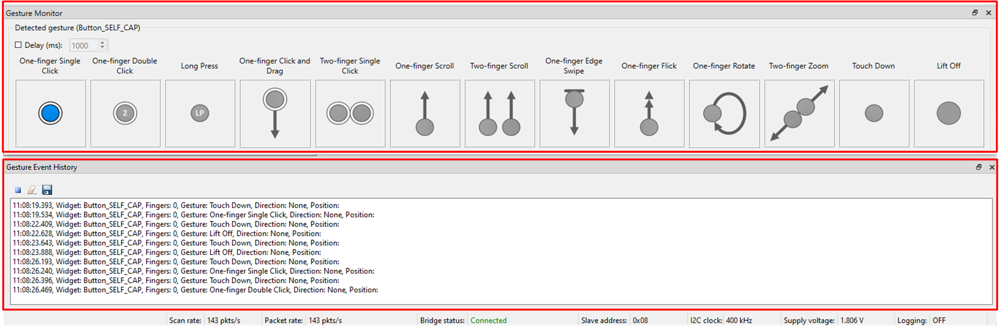
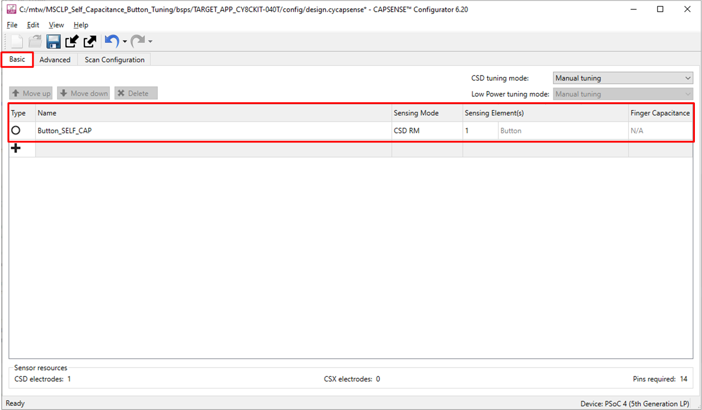
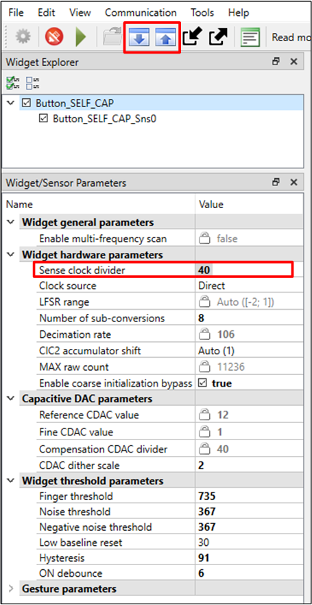
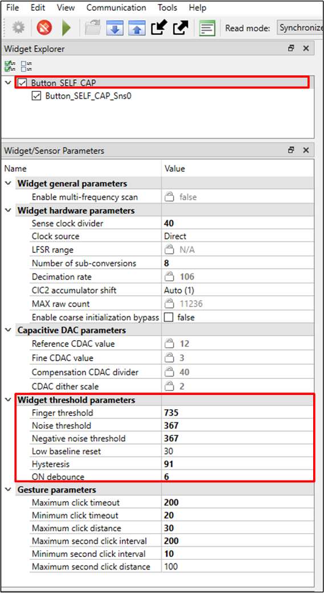
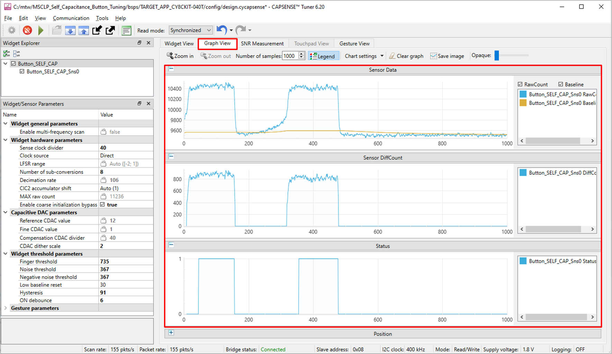
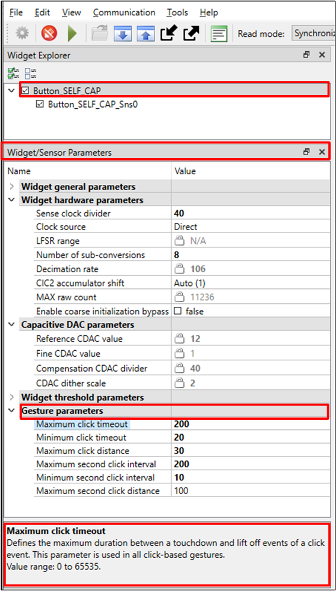
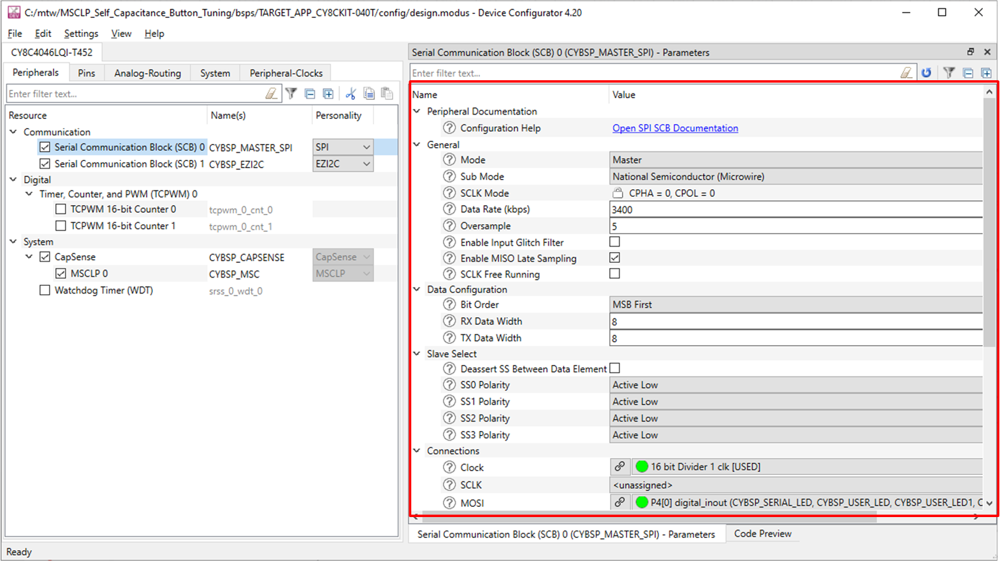

# PSoC&trade; 4: MSCLP self-capacitance button tuning

This code example demonstrates how to use the CAPSENSE&trade; middleware to detect a finger touch and gesture on a self-capacitance-based button widget in PSoC&trade; 4000T device with multi-sense converter low-power (MSCLP) CAPSENSE&trade; block.

In addition, this code example also explains how to manually tune the self-capacitance-based button for optimum performance with respect to parameters such as reliability, power consumption, and response time using the CSD-RM sensing technique and CAPSENSE&trade; Tuner GUI. Here, capacitive sigma-delta (CSD) represents the self-capacitance sensing technique, and RM represents the ratiometric method.

[View this README on GitHub.](https://github.com/Infineon/mtb-example-psoc4-msclp-csd-button)

[Provide feedback on this code example.](https://cypress.co1.qualtrics.com/jfe/form/SV_1NTns53sK2yiljn?Q_EED=eyJVbmlxdWUgRG9jIElkIjoiQ0UyMzUxNzgiLCJTcGVjIE51bWJlciI6IjAwMi0zNTE3OCIsIkRvYyBUaXRsZSI6IlBTb0MmdHJhZGU7IDQ6IE1TQ0xQIHNlbGYtY2FwYWNpdGFuY2UgYnV0dG9uIHR1bmluZyIsInJpZCI6Inlhc2h2aSIsIkRvYyB2ZXJzaW9uIjoiMy4wLjAiLCJEb2MgTGFuZ3VhZ2UiOiJFbmdsaXNoIiwiRG9jIERpdmlzaW9uIjoiTUNEIiwiRG9jIEJVIjoiSUNXIiwiRG9jIEZhbWlseSI6IlBTT0MifQ==)


## Requirements

- [ModusToolbox&trade;](https://www.infineon.com/cms/en/design-support/tools/sdk/modustoolbox-software/) v3.2 or later

   > **Note:** This code example version requires ModusToolbox&trade; version 3.2 or later and is not backward compatible with v3.1 or older versions.

- Board support package (BSP) minimum required version: 3.2.0
- Programming language: C
- Associated parts: [PSoC&trade; 4000T](https://www.infineon.com/cms/en/product/microcontroller/32-bit-psoc-arm-cortex-microcontroller/psoc-4-32-bit-arm-cortex-m0-mcu/psoc-4000/psoc-4000t/)

## Supported toolchains (make variable 'TOOLCHAIN')

- GNU Arm&reg; Embedded Compiler v11.3.1 (`GCC_ARM`) - Default value of `TOOLCHAIN`
- Arm&reg; Compiler v6.16 (`ARM`)
- IAR C/C++ Compiler v9.30.1 (`IAR`)

## Supported kits (make variable 'TARGET')

- [PSoC&trade; 4000T CAPSENSE&trade; Evaluation Kit](https://www.infineon.com/CY8CKIT-040T) (`CY8CKIT-040T`) - Default `TARGET`

## Hardware setup

This example uses the board's default configuration. See the [kit user guide](https://www.infineon.com/002-34870) to ensure that the board is configured correctly to use VDDA at 1.8 V.

## Software setup

This example requires no additional software or tools.

## Using the code example

### Create the project

The ModusToolbox&trade; tools package provides the Project Creator as both a GUI tool and a command line tool.

<details><summary><b>Use Project Creator GUI</b></summary>

1. Open the Project Creator GUI tool.

   There are several ways to do this, including launching it from the dashboard or from inside the Eclipse IDE. For more details, see the [Project Creator user guide](https://www.infineon.com/ModusToolboxProjectCreator) (locally available at *{ModusToolbox&trade; install directory}/tools_{version}/project-creator/docs/project-creator.pdf*).

2. On the **Choose Board Support Package (BSP)** page, select a kit supported by this code example. See [Supported kits](#supported-kits-make-variable-target).

   > **Note:** To use this code example for a kit not listed here, you may need to update the source files. If the kit does not have the required resources, the application may not work.

3. On the **Select Application** page:

   a. Select the **Applications(s) Root Path** and the **Target IDE**.

   > **Note:** Depending on how you open the Project Creator tool, these fields may be pre-selected for you.

   b.	Select this code example from the list by enabling its check box.

   > **Note:** You can narrow the list of displayed examples by typing in the filter box.

   c. (Optional) Change the suggested **New Application Name** and **New BSP Name**.

   d. Click **Create** to complete the application creation process.

</details>

<details><summary><b>Use Project Creator CLI</b></summary>

The 'project-creator-cli' tool can be used to create applications from a CLI terminal or from within batch files or shell scripts. This tool is available in the *{ModusToolbox&trade; install directory}/tools_{version}/project-creator/* directory.

Use a CLI terminal to invoke the 'project-creator-cli' tool. On Windows, use the command-line 'modus-shell' program provided in the ModusToolbox&trade; installation instead of a standard Windows command-line application. This shell provides access to all ModusToolbox&trade; tools. You can access it by typing "modus-shell" in the search box in the Windows menu. In Linux and macOS, you can use any terminal application.

The following example clones the "[PSoC&trade; 4: MSCLP self-capacitance button tuning](https://github.com/Infineon/mtb-example-psoc4-msclp-self-capacitance-button)" application with the desired name "MSCLPButtonTuning" configured for the [CY8CKIT-040T](https://www.infineon.com/CY8CKIT-040T) BSP into the specified working directory, *C:/mtb_projects*:

   ```
   project-creator-cli --board-id CY8CKIT-040T --app-id mtb-example-psoc4-msclp-self-capacitance-button --user-app-name MSCLPButtonTuning --target-dir "C:/mtb_projects"
   ```

The 'project-creator-cli' tool has the following arguments:

Argument | Description | Required/optional
---------|-------------|-----------
`--board-id` | Defined in the <id> field of the [BSP](https://github.com/Infineon?q=bsp-manifest&type=&language=&sort=) manifest | Required
`--app-id`   | Defined in the <id> field of the [CE](https://github.com/Infineon?q=ce-manifest&type=&language=&sort=) manifest | Required
`--target-dir`| Specify the directory in which the application is to be created if you prefer not to use the default current working directory | Optional
`--user-app-name`| Specify the name of the application if you prefer to have a name other than the example's default name | Optional

> **Note:** The project-creator-cli tool uses the `git clone` and `make getlibs` commands to fetch the repository and import the required libraries. For details, see the "Project creator tools" section of the [ModusToolbox&trade; tools package user guide](https://www.infineon.com/ModusToolboxUserGuide) (locally available at {ModusToolbox&trade; install directory}/docs_{version}/mtb_user_guide.pdf).

</details>


### Open the project

After the project has been created, you can open it in your preferred development environment.


<details><summary><b>Eclipse IDE</b></summary>

If you opened the Project Creator tool from the included Eclipse IDE, the project will open in Eclipse automatically.

For more details, see the [Eclipse IDE for ModusToolbox&trade; user guide](https://www.infineon.com/MTBEclipseIDEUserGuide) (locally available at *{ModusToolbox&trade; install directory}/docs_{version}/mt_ide_user_guide.pdf*).

</details>


<details><summary><b>Visual Studio (VS) Code</b></summary>

Launch VS Code manually, and then open the generated *{project-name}.code-workspace* file located in the project directory.

For more details, see the [Visual Studio Code for ModusToolbox&trade; user guide](https://www.infineon.com/MTBVSCodeUserGuide) (locally available at *{ModusToolbox&trade; install directory}/docs_{version}/mt_vscode_user_guide.pdf*).

</details>


<details><summary><b>Keil µVision</b></summary>

Double-click the generated *{project-name}.cprj* file to launch the Keil µVision IDE.

For more details, see the [Keil µVision for ModusToolbox&trade; user guide](https://www.infineon.com/MTBuVisionUserGuide) (locally available at *{ModusToolbox&trade; install directory}/docs_{version}/mt_uvision_user_guide.pdf*).

</details>


<details><summary><b>IAR Embedded Workbench</b></summary>

Open IAR Embedded Workbench manually, and create a new project. Then select the generated *{project-name}.ipcf* file located in the project directory.

For more details, see the [IAR Embedded Workbench for ModusToolbox&trade; user guide](https://www.infineon.com/MTBIARUserGuide) (locally available at *{ModusToolbox&trade; install directory}/docs_{version}/mt_iar_user_guide.pdf*).

</details>

<details><summary><b>Command line</b></summary>

If you prefer to use the CLI, open the appropriate terminal, and navigate to the project directory. On Windows, use the command-line 'modus-shell' program; on Linux and macOS, you can use any terminal application. From there, you can run various `make` commands.

For more details, see the [ModusToolbox&trade; tools package user guide](https://www.infineon.com/ModusToolboxUserGuide) (locally available at *{ModusToolbox&trade; install directory}/docs_{version}/mtb_user_guide.pdf*).

</details>

## Operation

1. Connect the board to your PC using the provided micro USB cable through the KitProg3 USB connector as follows:

   **Figure 1. Connecting the [CY8CKIT-040T](https://www.infineon.com/CY8CKIT-040T) kit with the PC**

   

   <br>


2. Program the board using one of the following:

   <details><summary><b>Using Eclipse IDE</b></summary>

      1. Select the application project in the Project Explorer.

      2. In the **Quick Panel**, scroll down, and click **\<Application Name> Program (KitProg3_MiniProg4)**.
   </details>

   <details><summary><b>Using CLI</b></summary>

     From the terminal, execute the `make program` command to build and program the application using the default toolchain to the default target. The target and the toolchain is specified manually:
      ```
      make program TARGET=<BSP> TOOLCHAIN=<toolchain>
      ```

      Example:
      ```
      make program TARGET=CY8CKIT-040T TOOLCHAIN=GCC_ARM
      ```
   </details>

4. After programming, the application starts automatically.

> **Note:** After programming, you will see the following error message if debug mode is disabled. This can be ignored or enabling debug solves this error.

   ``` c
   "Error: Error connecting Dp: Cannot read IDR"
   ```

4. To test the application, place your finger over the CAPSENSE&trade; button and notice that the LED1 turns ON with a green color when touched, and turns OFF when the finger is lifted. Observe the following LED2 colors for respective gesture performed:
   
   - One finger single-click > red color

   - One finger double-click > blue color 

5. You can also monitor the CAPSENSE&trade; data using the CAPSENSE&trade; Tuner application as follows:

### Monitor data using the Tuner


1. Open the CAPSENSE&trade; Tuner from the **Tools** section in the IDE **Quick Panel**.

   You can also run the CAPSENSE&trade; Tuner application standalone from *{ModusToolbox&trade; install directory}/ModusToolbox/tools_{version}/capsense-configurator/capsense-tuner*. In this case, after opening the application, select **File** > **Open** and open the *design.cycapsense* file of the respective application, which is present in the *{Application root directory}/bsps/TARGET_APP_\<BSP-NAME>/config* folder.

   See the [ModusToolbox&trade; user guide](https://www.infineon.com/ModusToolboxUserGuide) (locally available at *ModusToolbox&trade; install directory/docs_{version}/mtb_user_guide.pdf*) for options to open the CAPSENSE&trade; Tuner application using the CLI.

2. Ensure the kit is in CMSIS-DAP bulk mode (KitProg3 status LED is ON and not blinking). See [Firmware-loader](https://github.com/Infineon/Firmware-loader) to learn how to update the firmware and switch modes in KitProg3.
  
3. In the tuner application, click on the **Tuner Communication Setup** icon or select **Tools** > **Tuner Communication Setup**. In the window, select the I2C checkbox under KitProg3 and configure as follows:

   - **I2C address:** 8
   - **Sub-address:** 2-Bytes
   - **Speed (kHz):** 400

   These are the same values set in the EZI2C resource.

   **Figure 2. Tuner Communication Setup parameters**

   

    <br>

4. Click **Connect** or select **Communication** > **Connect** to establish a connection.

   **Figure 3. Establish connection**

   

   <br>

5. Click **Start** or select **Communication** > **Start** to start data streaming from the device.

   **Figure 4. Start Tuner Communication**

    

    <br>

    The **Widget/Sensor parameters** tab gets updated with the parameters configured in the **CAPSENSE&trade; Configurator** window. The tuner displays the data from the sensor in the **Widget View** and **Graph View** tabs.

6. Set the **Read mode** to **Synchronized** mode. Navigate to the **Widget View** tab, and you can see the **Button_SELF_CAP** widget highlighted in **blue** color when you touch it.

   **Figure 5. Widget View of the CAPSENSE&trade; Tuner**

   

   <br>

7. You can view the raw count, baseline, difference count, and status for each sensor in the **Graph View** tab. For example, to view the sensor data for Button_SELF_CAP, select **Button_SELF_CAP_Sns0** under **Button_SELF_CAP**.

   **Figure 6. Graph View for the CAPSENSE&trade; Tuner**

   

   <br>

8. Observe the **Widget/Sensor parameters** section in the CAPSENSE&trade; Tuner window as shown in Figure 6.
      
9. Switch to the **SNR Measurement** tab for measuring the SNR. Verify that the SNR is greater than 5:1 and the signal count is above 50. Select the **Button_SELF_CAP** and **Button_SELF_CAP_Sns0** sensors, and then click **Acquire Noise** as shown in Figure 7.

   **Figure 7. CAPSENSE&trade; Tuner – SNR measurement: Acquire noise**

   
         
   <br>

10. Once the noise is acquired, place the metal finger (6 mm finger is used in this example) at a position on the button and then click **Acquire Signal**. Ensure that the metal finger remains on the button as long as the signal acquisition is in progress. Observe that the SNR is above 5:1 and the signal count is above 50.

      The calculated SNR on this button is displayed as shown in Figure 8. Based on your end- system design, test the signal with a finger that matches the size of your normal use case. Typically, finger-size targets are ~4 to 8 mm. Consider testing with smaller sizes that should be rejected by the system to ensure that they do not reach the finger threshold.

      **Figure 8. CAPSENSE&trade; Tuner – SNR measurement: Acquire signal**

      

    <br>
11. **Gesture Monitor** provides visual indication for a detected gesture. **Gesture Event History** logs the detected gestures information.

      > **Note:** To open the Gesture Monitor window, select **View** > **Gesture Monitor/Gesture Event History**


      **Figure 9. Gesture monitor view of the CAPSENSE&trade; Tuner**

      

## Operation at other voltages

[CY8CKIT-040T kit](https://www.infineon.com/CY8CKIT-040T) supports operating voltages of 1.8 V, 3.3 V, and 5 V. Use voltage selection switch available on top of the kit to set the preferred operating voltage and see the [Setup the VDDA supply voltage and Debug mode](#set-up-the-vdda-supply-voltage-and-debug-mode-in-device-configurator) section.

This application functionalities are optimally tuned for 1.8 V. However, you can observe the basic functionalities working across other voltages. 

It is recommended to tune the application with the preferred voltages for better performance.

</details>

## Tuning procedure

<details><summary><b> Create a custom BSP for your board </b></summary>

1. Create a custom BSP for your board having any device, by following the steps given in [ModusToolbox&trade; BSP Assistant user guide](https://www.infineon.com/ModusToolboxBSPAssistant). This code example was created for the device "CY8C4046LQI-T452".

2. Open the *design.modus* file from the *{Application root directory}/bsps/TARGET_APP_\<BSP-NAME>/config/* folder obtained in the previous step and enable CAPSENSE&trade; to get the *design.cycapsense* file. CAPSENSE&trade; configuration can then be started from scratch as follows.


</details>

The following steps explain the tuning procedure: 

> **Note:** See the section "Selecting CAPSENSE&trade; hardware parameters" in the [PSoC&trade; 4 and PSoC&trade; 6 MCU CAPSENSE&trade; design guides](https://www.infineon.com/AN85951) to learn about the considerations for selecting each parameter value.

**Figure 10. CSD button widget tuning flow**

 

###### Do the following to tune the button widget:

- [Stage 1: Set the initial hardware parameters](#stage-1-set-the-initial-hardware-parameters)

- [Stage 2: Set the sense clock frequency](#stage-2-set-the-sense-clock-frequency)

- [Stage 3: Fine-tune sensitivity for required SNR and refresh rate](#stage-3-fine-tune-sensitivity-for-required-snr-and-refresh-rate)

- [Stage 4: Tune threshold parameters](#stage-4-tune-threshold-parameters)

- [Stage 5: Set gesture parameters](#stage-5-set-gesture-parameters)

### Stage 1: Set the initial hardware parameters
-----------

1. Connect the board to your PC using the provided USB cable through the KitProg3 USB connector.
2. Launch the Device Configurator tool.

   You can launch the Device Configurator in Eclipse IDE for ModusToolbox&trade; from the **Tools** section in the IDE Quick panel or in standalone mode from *{ModusToolbox&trade; install directory}/ModusToolbox/tools_{version}/device-configurator/device-configurator*. In this case, after opening the application, select **File** > **Open** and open the *design.modus* file of the respective application, located in the *{Application root directory}/bsps/TARGET_APP_\<BSP-NAME>/config/* folder.

3. In the PSoC&trade; [4000T](https://www.infineon.com/CY8CKIT-040T) kit, the button pin is connected to CAPSENSE&trade; channel (MSCLP 0). Therefore, make sure to enable CAPSENSE&trade; channel in the Device Configurator as shown in Figure 11.

   **Figure 11. Enable MSCLP channels in Device Configurator**

   

      Save the changes and close the window.

4. Launch the CAPSENSE&trade; Configurator tool.
   
   You can launch the CAPSENSE&trade; configurator tool in Eclipse IDE for ModusToolbox&trade; from the 'CAPSENSE&trade;' peripheral setting in the device configurator or directly from the **Tools** section in the IDE Quick panel. You can also launch it in standalone mode from *{ModusToolbox&trade; install directory}/ModusToolbox/tools_{version}/capsense-configurator/capsense-configurator*. In this case, after opening the application, select **File** > **Open** and open the *design.cycapsense* file of the respective application, which is present in the *{Application root directory}/bsps/TARGET_APP_\<BSP-NAME>/config/* folder.

   See the [ModusToolbox&trade; CAPSENSE&trade; configurator tool guide](https://www.infineon.com/ModusToolboxCapSenseConfig) for step-by-step instructions on how to configure and launch CAPSENSE&trade; in ModusToolbox&trade;. 

5. In the **Basic** tab, note that the button widget 'Button_SELF_CAP' is configured as a CSD-RM (self-cap).

   **Figure 12. CAPSENSE&trade; Configurator – Basic tab**

   

   <br>

6. Go to **Advanced** > **General** tab, and do the following:

   - Select **CAPSENSE&trade; IMO clock frequency** as **46 MHz**.

   - Set **Modulator clock divider** to **1** to obtain the maximum available modulator clock frequency as recommended in the [PSoC&trade; 4 and PSoC&trade; 6 MCU CAPSENSE&trade; design guide](https://documentation.infineon.com/html/psoc6/epf1667481159393.html).

      >**Note:** The modulator clock frequency can be set to 46,000 kHz after changing the CAPSENSE&trade; IMO clock frequency to 46 MHz, because the modulator clock is derived from the CAPSENSE&trade; IMO clock. In the **CAPSENSE&trade; IMO clock frequency** drop-down list, select **46 MHz**. 

   - **Number of init sub-conversions** is set based on the hint shown when you hover over the edit box. Retain the default value. 
   
   - Because CIC2 filter is enabled, it is recommended to enable the IIR filter. Retain the default settings for all filters. You can enable the filters later depending on the signal-to-noise ratio (SNR) requirements mentioned in [Stage 3](#stage-3-fine-tune-sensitivity-for-required-snr-and-refresh-rate).
        
        Filters are used to reduce the peak-to-peak noise. Using filters will result in higher scan time.

   **Figure 13. CAPSENSE&trade; Configurator - General settings**

   

   <br> 

   >**Note:** Each tab has a **Restore Defaults** button to restore the parameters of that tab to their default values.

7. Go to the **CSD Settings** tab and make the following changes:

   - Set **Inactive sensor connection** as **Shield**.

   - Set **Shield mode** as **Active**.

   - Set **Total shield count** to **11**.

     To improve noise immunity, configure all the unused sensor pins as shield. 

   - **Raw count calibration level (%)** helps in achieving the required CDAC calibration levels (85% of maximum count by default) for all sensors in the widget, while maintaining the same sensitivity across the sensor elements.<br>
   Raw count calibration level can be reduced if the application reaches the saturation level on a touch event.

   **Figure 14. CAPSENSE&trade; Configurator - Advanced CSD settings**

   

   <br>

8. Go to the **Widget Details** tab. Select **Button_SELF_CAP** from the left pane, and then set the following:

   - **Sense clock divider:** Retain default value (will be set in [Stage 2](#stage-2-set-the-sense-clock-frequency))

   - **Clock source:** Direct

      >**Note:** Spread spectrum clock (SSC) or PRS clock can be used as a clock source to deal with EMI/EMC issues.

   - **Number of sub-conversions:** 60

     '60' is a good starting point to ensure a fast scan time and sufficient signal. This value will be adjusted as required in [Stage 4](#stage-4-tune-threshold-parameters). 

   - **Finger threshold:** 20

   - **Noise threshold:** 10

   - **Negative noise threshold:** 10

   - **Low-baseline reset:** 30

   - **Hysteresis:** 5

   - **ON debounce:** 3

      These values reduces the influence of baseline on the sensor signal, which helps to get the true difference-count. Retain the default values for the widget threshold parameters; these parameters are set in [Stage 4](#stage-4-tune-threshold-parameters).

   **Figure 15. CAPSENSE&trade; Configurator - Widget details tab under the Advanced tab**
      
   

   <br>

9. Go to the **Scan Configuration** tab to select the pins, the scan slots, and do the following:

   - Configure the pin for the electrode using the drop-down menu.

   - Configure the scan slot using the **Auto-Assign Slots** option or each sensor is allotted a scan slot based on the entered slot number. 

   - Check the notice list for warning or errors. 
   
      >**Note:** Enable the **Notice List** in the **View** menu if it is not visible.

   **Figure 16. Scan Configuration tab**

   

   <br>

10. Click **Save** to apply the settings.


### Stage 2: Set the sense clock frequency
----------

The sense clock is derived from the modulator clock using a clock-divider and is used to scan the sensor by driving the CAPSENSE&trade; switched capacitor circuits. Both the clock source and clock divider are configurable. The sense clock divider should be configured such that the pulse width of the sense clock is long enough to allow the sensor capacitance to charge and discharge completely. This is verified by observing the charging and discharging waveforms of the sensor, using an oscilloscope and an active probe. The sensors should be probed close to the electrode, and not at the sense pins or the series resistor. 

Refer to Figure 17 and Figure 18 for waveforms observed on the shield. Figure 17 shows proper charging when sense clock frequency is correctly tuned. The pulse width is at least 5 tau  i.e., the voltage is reaching at least 99.3% of the required voltage at the end of each phase. Figure 18 shows incomplete settling (charging/discharging).

**Figure 17. Proper charge cycle of a sensor**


**Figure 18. Improper charge cycle of a sensor**


###### To set the sense clock frequency, do the following:  
  
1. Program the board and launch CAPSENSE&trade; Tuner.

2. Observe the charging waveform of the sensor as described above. 

3. If the charging is incomplete, increase the Sense clock divider. This can be done in CAPSENSE&trade; Tuner by selecting the sensor and editing the Sense clock divider parameter in the Widget/Sensor Parameters panel.

   > **Note:** The sense clock divider should be **divisible by 4**. This ensures that all four scan phases have equal durations. 

   After editing the value click the Apply to Device button and observe the waveform again. Repeat this until complete settling is observed.  
   
4. Click the Apply to Project button so that the configuration is saved to your project. 

   **Figure 19. Sense clock divider setting**

   

   <br>
   

5. Repeat this process for all the sensors and the shield. Each sensor might require a different sense clock divider value to charge/discharge completely. But all the sensors which are in the same scan slot need to have the same sense clock source, sense clock divider, and number of sub-conversions. Therefore take the largest sense clock divider in a given scan slot and apply it to all the other sensors that share that slot.


### Stage 3: Fine-tune sensitivity for required SNR and refresh rate
---------

The sensor should be tuned to have a minimum SNR of 5:1 and a minimum signal of 50 to ensure reliable operation. The sensitivity can be increased by increasing number of sub-conversions and noise can be decreased by enabling filters. 

   > **Note:** If the sensor raw count saturates (equals Max Raw count) on touch, reduce the Raw count calibration level (%) to help with avoiding saturation.

The steps for optimizing these parameters are as follows:

1. Measure the SNR as mentioned in the [Operation](#operation) section.

2. If the SNR is less than 5:1, increase the number of sub-conversions. Edit the number of sub-conversions (N<sub>sub</sub>) directly in the **Widget/Sensor parameters** tab of the CAPSENSE&trade; Tuner.

      > **Note:** Number of sub-conversion should be greater than or equal to 8.

3. Load the parameters to the device and measure SNR as mentioned in steps 9 and 10 in the [Monitor data using the Tuner](#monitor-data-using-the-tuner) section. 
   
   Repeat steps 1 to 3 until the following conditions are met:
      - Measured SNR from the previous stage is greater than 5:1
      - Signal count is greater than 50

4. If the system is very noisy (>40% of Signal), enable filters.

   This example has the CIC2 filter enabled, which increases the resolution for the same scan time. See [AN234231 - Achieving lowest-power capacitive sensing with PSoC&trade; 4000T](https://www.infineon.com/dgdl/Infineon-AN234231_PSoC_4000T_Lowest_Power_CAPSENSE-ApplicationNotes-v06_00-EN.pdf?fileId=8ac78c8c8929aa4d0189f4a848e350bc) for detailed information on the CIC2 filter. Whenever CIC2 filter is enabled, it is recommended to enable the IIR filter for optimal noise reduction. Therefore this example has the IIR filter enabled as well.
   <ol type="A">
   <li>

   Open **CAPSENSE&trade; Configurator** from ModusToolbox&trade; Quick Panel and select the appropriate filter:

   **Figure 20. Filter settings in CAPSENSE&trade; Configurator**

   
   </li>

   <br>
   <li>

   Enable the filter based on the type of noise in your system. See [AN85951 – PSoC&trade; 4 and PSoC&trade; 6 MCU CAPSENSE&trade; design guide](https://www.infineon.com/AN85951) for more details.
   </li>
   <li>

   Click Save and close CAPSENSE&trade; Configurator. Program the device to update the filter settings.
   </li>

   >**Note** : Increasing number of sub-conversions and enabling filters will increase the scan time which in turn decreasing the responsiveness of the Sensor. Increase in scan time also increases the power consumption. Therefore the number of sub-conversions and filter configuration must be optimized to achieve a balance between SNR, power and refresh rate.

### Stage 4: Tune threshold parameters
---------

Various thresholds, relative to the signal, need to be set for each sensor. Do the following in CAPSENSE&trade; Tuner to set up the thresholds for a widget:

1. Switch to the **Graph View** tab and select **Button_SELF_CAP**.

2. Touch the sensor and monitor the touch signal in the sensor signal graph, as shown in Figure 21. 

   **Figure 21. Sensor signal when the sensor is touched**

   

   <br>

3. When the signal is measured, set the thresholds according to the following recommendations:

   - **Finger threshold =** 80% of the signal

   - **Noise threshold =** 40% of the signal

   - **Negative noise threshold** = 40% of the signal

   - **Hysteresis =** 10% of the signal

   - **Debounce =** 6

4. Set the threshold parameters in the **Widget/Sensor Parameters** section of the CAPSENSE&trade; Tuner:

   **Figure 22. Widget threshold parameters**

   

   <br>

5. Apply the settings to the device and to the project by clicking **Apply to Device**.

   **Figure 23. Apply settings to device**

   
   
   After applying the configuration test the performance by touching the button. If your sensor is tuned correctly, you will observe the touch status go from 0 to 1 in the **Status** panel of the **Graph View** tab as Figure 24 shows. The status of the button is also indicated by  LED1 in the kit; LED1 turns ON when the finger touches the button and turns OFF when the finger is removed.

   **Figure 24. Sensor status in CAPSENSE&trade; Tuner**

   

   <br>

6. Click **Apply to Project** as Figure 25 shows. The change is updated in the *design.cycapsense* file. Close **CAPSENSE&trade; Tuner** and launch **CAPSENSE&trade; Configurator**. You should now see all the changes that you made in the CAPSENSE&trade; Tuner reflected in the **CAPSENSE&trade; Configurator**.

   **Figure 25. Apply settings to project**

   

   ##### Table 1. Software tuning parameters obtained based on sensors for [CY8CKIT-040T](https://www.infineon.com/CY8CKIT-040T)
  
   |Parameter|	CY8CKIT–040T (Pin P4.1)|
   |:--------|:------|
   |Signal	|919	|
   |Finger threshold 	|735|
   |Noise threshold |367|
   |Negative noise threshold	|367|
   |Hysteresis	| 91 |
   |ON debounce	|6|
   |Low baseline reset	|30| 


### Stage 5: Set gesture parameters
---------

You can set the gesture parameters directly in the **Widget/Sensor parameters** tab of the CAPSENSE&trade; Tuner and observe the results in the Gesture Monitor/Gesture View. 

>**Note:** Click on the parameter to understand the definition and its valid range.

   **Figure 26. Gesture parameters**

   

   <br>

In this application gesture parameters have been set for the typical use case, but you can change these parameters as per the need of application use case. 

## Debugging

You can debug this project to step through the code. In the IDE, use the **\<Application Name> Debug (KitProg3_MiniProg4)** configuration in the **Quick Panel**. For details, see the "Program and debug" section in the [Eclipse IDE for ModusToolbox&trade; user guide](https://www.infineon.com/MTBEclipseIDEUserGuide).

By default, the debug option is disabled in the Device Configurator. To enable the debug option, see the [Setup VDDA and Debug mode](#set-up-the-vdda-supply-voltage-and-debug-mode-in-device-configurator) section. To achieve low power consumption, it is recommended to disable it.

## Design and implementation

The project contains a button widget configured in CSD-RM sensing mode. See the [Tuning procedure](#tuning-procedure) section for step-by-step instructions to configure the other settings of the **CAPSENSE&trade; Configurator**.

The project uses the [CAPSENSE&trade; middleware](https://github.com/Infineon/capsense) (see ModusToolbox&trade; user guide for more details on selecting a middleware). See [AN85951 - PSoC&trade; 4 and PSoC&trade; 6 MCU CAPSENSE&trade; design guide](https://www.infineon.com/dgdl/Infineon-AN85951_PSoC_4_and_PSoC_6_MCU_CapSense_Design_Guide-ApplicationNotes-v27_00-EN.pdf?fileId=8ac78c8c7cdc391c017d0723535d4661) for more details on CAPSENSE&trade; features and usage.

The [ModusToolbox&trade;](https://www.infineon.com/cms/en/design-support/tools/sdk/modustoolbox-software) provides a GUI-based tuner application for debugging and tuning the CAPSENSE&trade; system. The *CAPSENSE&trade; Tuner* application works with EZI2C and UART communication interfaces. This project has an SCB block configured in EZI2C mode to establish communication with the on-board KitProg, which in turn enables reading the CAPSENSE&trade; raw data by the CAPSENSE&trade; Tuner. See [EZI2C - Peripheral settings](#resources-and-settings).

The CAPSENSE&trade; data structure that contains the CAPSENSE&trade; raw data is exposed to the CAPSENSE&trade; Tuner by setting up the I2C communication data buffer with the CAPSENSE&trade; data structure. This enables the tuner to access the CAPSENSE&trade; raw data for tuning and debugging CAPSENSE&trade;.

The successful tuning of the button is indicated by the RGB LED in the Evaluation Kit; the LED is turned ON when the finger touches the button and turned OFF when the finger is removed from the button.

The MOSI pin of the SPI slave peripheral is used to transfer data to the three serially connected LEDs for controlling color, brightness, and ON or OFF operation. The three LEDs form a daisy-chain connection, and communication happens over the serial interface to create an RGB configuration. The LED accepts a 32-bit input code, with three bytes for red, green, and blue colors, five bits for global brightness, and three blank '1' bits. See the [LED datasheet](https://media.digikey.com/pdf/Data%20Sheets/Everlight%20PDFs/12-23C_RSGHBHW-5V01_2C_Rev4_12-17-18.pdf) for more details.

### Set up the VDDA supply voltage and Debug mode in Device Configurator

1. Open **Device Configurator** from the **Quick panel**. 

2. Go to the **System** tab. Select the **Power** resource, and set the VDDA value under **Operating Conditions** as shown in Figure 27. 

   **Figure 27. Setting the VDDA supply in the System tab of the Device Configurator**

    

   <br>

3. By default, the Debug mode is disabled for this application to reduce power consumption. Enable the Debug mode to enable the SWD pins as follows:

   **Figure 28. Enable Debug mode in the System tab of the Device Configurator**

   


### Resources and settings

**Figure 29. EZI2C settings**


<br>

**Figure 30. SPI settings**



##### Table 2. Application resources

| Resource  |  Alias/object     |    Purpose     |
| :------- | :------------    | :------------ |
| SCB (EZI2C) (PDL) | CYBSP_EZI2C          | EZI2C slave driver to communicate with CAPSENSE&trade; Tuner |
| CAPSENSE&trade; | CYBSP_MSC | CAPSENSE&trade; driver to interact with the MSCLP hardware and interface the CAPSENSE&trade; sensors |
| Digital pin     | CYBSP_SERIAL_LED | To show the button operation|
|SCB (SPI) (PDL)  | CYBSP_MASTER_SPI | SPI master driver to drive the serial LED which visualizes button response|

</details> 

### Firmware flow

**Figure 31. Firmware flowchart**


<br>

## Related resources

Resources  | Links
-----------|----------------------------------
Application notes  | [AN79953](https://www.infineon.com/AN79953) - Getting started with PSoC&trade; 4 <br> [AN85951](https://www.infineon.com/AN85951) - PSoC&trade; 4 and PSoC&trade; 6 MCU CAPSENSE&trade; design guide <br> [AN234231](https://www.infineon.com/dgdl/Infineon-AN234231_PSoC_4000T_Lowest_Power_CAPSENSE-ApplicationNotes-v06_00-EN.pdf?fileId=8ac78c8c8929aa4d0189f4a848e350bc) - Achieving lowest-power capacitive sensing with PSoC&trade; 4000T
Code examples | [Using ModusToolbox&trade;](https://github.com/Infineon/Code-Examples-for-ModusToolbox-Software) on GitHub
Device documentation | [PSoC&trade; 4 datasheets](https://www.infineon.com/cms/en/search.html?intc=searchkwr-return#!view=downloads&term=psoc%204&doc_group=Data%20Sheet) <br>[PSoC&trade; 4 technical reference manuals](https://www.infineon.com/cms/en/search.html#!term=psoc%204%20technical%20reference%20manual&view=all)
Development kits | Select your kits from the [Evaluation board finder](https://www.infineon.com/cms/en/design-support/finder-selection-tools/product-finder/evaluation-board)
Libraries on GitHub  | [mtb-hal-cat2](https://github.com/Infineon/mtb-hal-cat2) - Hardware Abstraction Layer (HAL) library
Middleware on GitHub | [CAPSENSE&trade; Middleware Library](https://github.com/Infineon/capsense) - CAPSENSE&trade; library and documents <br>
Tools | [Eclipse IDE for ModusToolbox&trade;](https://www.infineon.com/modustoolbox) - ModusToolbox&trade; is a collection of easy-to-use software and tools enabling rapid development with Infineon MCUs, covering applications from embedded sense and control to wireless and cloud-connected systems using AIROC&trade; Wi-Fi and Bluetooth&reg; connectivity devices.

## Other resources

Infineon provides a wealth of data at [www.infineon.com](https://www.infineon.com) to help you select the right device, and quickly and effectively integrate it into your design.

## Document history

Document title: *CE235178* - *PSoC&trade; 4: MSCLP self-capacitance button tuning*

 Version | Description of change
 ------- | ---------------------
 1.0.0   | New code example. <br> This version is not backward compatible with ModusToolbox&trade; v2.4.
 1.0.1   | Minor readme update.
 1.1.0   | Minor folder structure changes that doesn't break backward compatibility.
 2.0.0   | Major update to support ModusToolbox&trade; v3.1 and the BSP changes. This version is not backward compatible with previous versions of ModusToolbox&trade;.
 2.1.0   | Gesture feature demonstrated on CSD Button. 
 2.1.1   | Minor configuration and readme update  
 3.0.0   | Major update to support ModusToolbox&trade; v3.2 and CAPSENSE&trade; Middleware v5.0. This version is not backward compatible with previous versions of ModusToolbox&trade;.

---

All other trademarks or registered trademarks referenced herein are the property of their respective owners.  
The Bluetooth&reg; word mark and logos are registered trademarks owned by Bluetooth SIG, Inc., and any use of such marks by Infineon is under license.


---

© Cypress Semiconductor Corporation, 2023. This document is the property of Cypress Semiconductor Corporation, an Infineon Technologies company, and its affiliates ("Cypress").  This document, including any software or firmware included or referenced in this document ("Software"), is owned by Cypress under the intellectual property laws and treaties of the United States and other countries worldwide.  Cypress reserves all rights under such laws and treaties and does not, except as specifically stated in this paragraph, grant any license under its patents, copyrights, trademarks, or other intellectual property rights.  If the Software is not accompanied by a license agreement and you do not otherwise have a written agreement with Cypress governing the use of the Software, then Cypress hereby grants you a personal, non-exclusive, nontransferable license (without the right to sublicense) (1) under its copyright rights in the Software (a) for Software provided in source code form, to modify and reproduce the Software solely for use with Cypress hardware products, only internally within your organization, and (b) to distribute the Software in binary code form externally to end users (either directly or indirectly through resellers and distributors), solely for use on Cypress hardware product units, and (2) under those claims of Cypress’s patents that are infringed by the Software (as provided by Cypress, unmodified) to make, use, distribute, and import the Software solely for use with Cypress hardware products.  Any other use, reproduction, modification, translation, or compilation of the Software is prohibited.
<br>
TO THE EXTENT PERMITTED BY APPLICABLE LAW, CYPRESS MAKES NO WARRANTY OF ANY KIND, EXPRESS OR IMPLIED, WITH REGARD TO THIS DOCUMENT OR ANY SOFTWARE OR ACCOMPANYING HARDWARE, INCLUDING, BUT NOT LIMITED TO, THE IMPLIED WARRANTIES OF MERCHANTABILITY AND FITNESS FOR A PARTICULAR PURPOSE.  No computing device can be absolutely secure.  Therefore, despite security measures implemented in Cypress hardware or software products, Cypress shall have no liability arising out of any security breach, such as unauthorized access to or use of a Cypress product. CYPRESS DOES NOT REPRESENT, WARRANT, OR GUARANTEE THAT CYPRESS PRODUCTS, OR SYSTEMS CREATED USING CYPRESS PRODUCTS, WILL BE FREE FROM CORRUPTION, ATTACK, VIRUSES, INTERFERENCE, HACKING, DATA LOSS OR THEFT, OR OTHER SECURITY INTRUSION (collectively, "Security Breach").  Cypress disclaims any liability relating to any Security Breach, and you shall and hereby do release Cypress from any claim, damage, or other liability arising from any Security Breach.  In addition, the products described in these materials may contain design defects or errors known as errata which may cause the product to deviate from published specifications. To the extent permitted by applicable law, Cypress reserves the right to make changes to this document without further notice. Cypress does not assume any liability arising out of the application or use of any product or circuit described in this document. Any information provided in this document, including any sample design information or programming code, is provided only for reference purposes.  It is the responsibility of the user of this document to properly design, program, and test the functionality and safety of any application made of this information and any resulting product.  "High-Risk Device" means any device or system whose failure could cause personal injury, death, or property damage.  Examples of High-Risk Devices are weapons, nuclear installations, surgical implants, and other medical devices.  "Critical Component" means any component of a High-Risk Device whose failure to perform can be reasonably expected to cause, directly or indirectly, the failure of the High-Risk Device, or to affect its safety or effectiveness.  Cypress is not liable, in whole or in part, and you shall and hereby do release Cypress from any claim, damage, or other liability arising from any use of a Cypress product as a Critical Component in a High-Risk Device. You shall indemnify and hold Cypress, including its affiliates, and its directors, officers, employees, agents, distributors, and assigns harmless from and against all claims, costs, damages, and expenses, arising out of any claim, including claims for product liability, personal injury or death, or property damage arising from any use of a Cypress product as a Critical Component in a High-Risk Device. Cypress products are not intended or authorized for use as a Critical Component in any High-Risk Device except to the limited extent that (i) Cypress’s published data sheet for the product explicitly states Cypress has qualified the product for use in a specific High-Risk Device, or (ii) Cypress has given you advance written authorization to use the product as a Critical Component in the specific High-Risk Device and you have signed a separate indemnification agreement.
<br>
Cypress, the Cypress logo, and combinations thereof, ModusToolbox, PSoC, CAPSENSE, EZ-USB, F-RAM, and TRAVEO are trademarks or registered trademarks of Cypress or a subsidiary of Cypress in the United States or in other countries. For a more complete list of Cypress trademarks, visit www.infineon.com. Other names and brands may be claimed as property of their respecti
